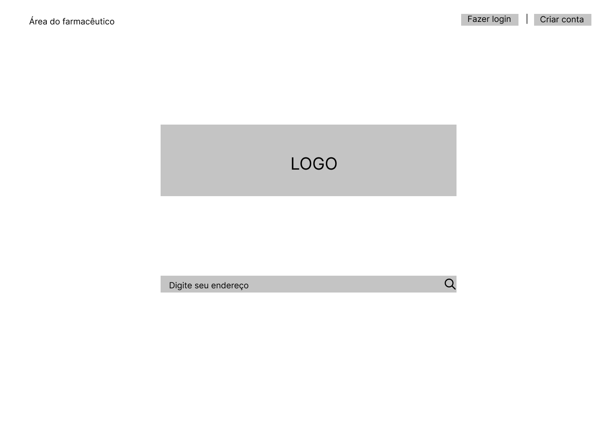
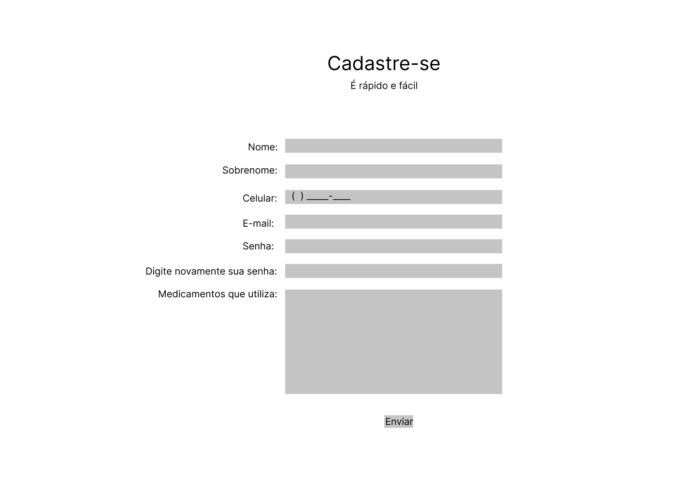
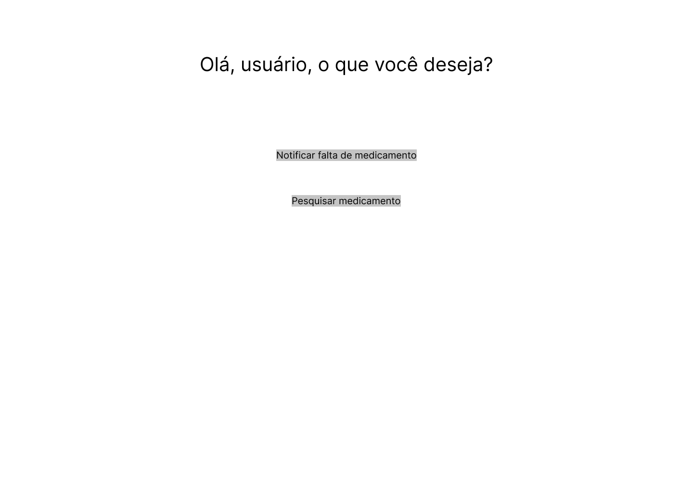
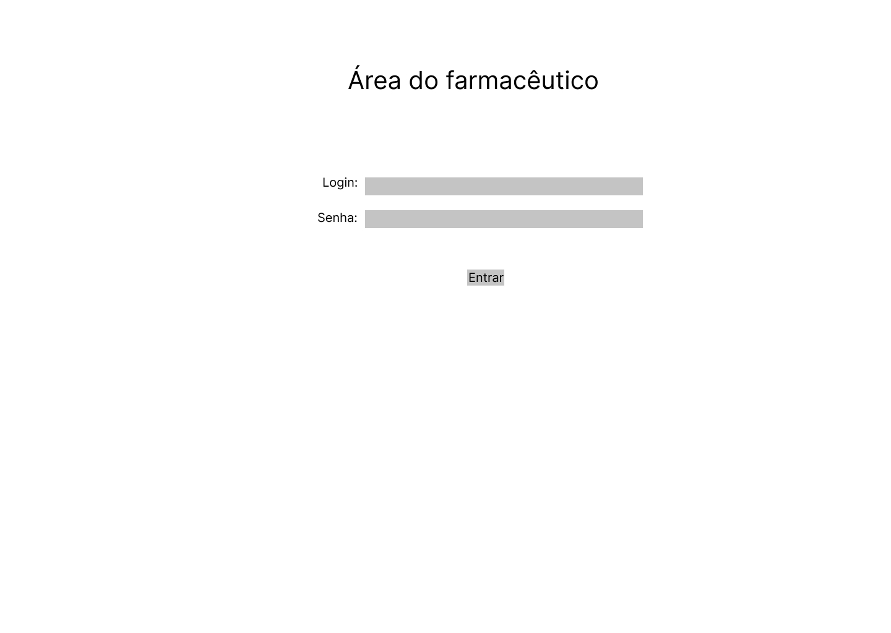

# Projeto de Interface

Pré-requisitos: <a href="2-Especificação do Projeto.md"> Documentação de Especificação</a>

Visão geral da interação do usuário pelas telas do sistema e protótipo interativo das telas com as funcionalidades que fazem parte do sistema (wireframes).

 Apresente as principais interfaces da plataforma. Discuta como ela foi elaborada de forma a atender os requisitos funcionais, não funcionais e histórias de usuário abordados nas <a href="2-Especificação do Projeto.md"> Documentação de Especificação</a>.

## User Flow

Fluxo de usuário (User Flow) é uma técnica que permite ao desenvolvedor mapear todo fluxo de telas do site ou app. Essa técnica funciona para alinhar os caminhos e as possíveis ações que o usuário pode fazer junto com os membros de sua equipe.

> **Links Úteis**:
> - [User Flow: O Quê É e Como Fazer?](https://medium.com/7bits/fluxo-de-usu%C3%A1rio-user-flow-o-que-%C3%A9-como-fazer-79d965872534)
> - [User Flow vs Site Maps](http://designr.com.br/sitemap-e-user-flow-quais-as-diferencas-e-quando-usar-cada-um/)
> - [Top 25 User Flow Tools & Templates for Smooth](https://www.mockplus.com/blog/post/user-flow-tools)

## Wireframes

Conforme fluxo de telas do projeto, apresentado no item anterior, as telas do sistema são discutidas em detalhes nos itens que se seguem. 

### Tela - Home-Page 

A tela de home-page mostra, em destaque, o logo de identidade visual do Medicamento Fácil. Abaixo, há uma linha de pesquisa, na qual o usuário deve digitar o seu endereço, para que a busca mostre os resultados mais próximos de sua localização. 

No bloco superior esquerdo, o usuário pode acessar a área do farmacêutico, cujo acesso estará disponível apenas para estes profissionais. Já o bloco superior direito é para acesso dos usuários finais, tanto para fazer login, quanto para criarem uma conta. 

### Tela – Cadastre-se 

Ao clicar em “criar conta” na tela de home-page, o usuário será redirecionado a esta tela, na qual deverá preencher seus dados pessoais, criar uma senha e adicionar os medicamentos que utilizar. 

### Tela - Faça login 

Ao clicar em “fazer login” na tela de home-page, o usuário será redirecionado a esta tela, na qual deverá inserir seu e-mail cadastrado e senha, para acessar a área do usuário. Esta tela também apresenta o botão “esqueceu sua senha?” para o caso em que o usuário necessite recuperar o acesso. 

 ### Tela - Seleção de função pelo usuário
 
 A tela oferece ao usuário a possibilidade de escolher entre as duas funcionalidade do "Medicamento Fácil": 1) Notificar falta de medicamento ou 2) Pesquisar medicamento;

### Tela - Login do Farmacêutico

O usuário farmacêutico, responsável pelo controle de medicamentos da UBS - Unidade Básica de saúde, fará o login nessa tela, na qual será necessário informar e-mail e senha cadastrados. 

