# Projeto de Interface

Para a montagem da interface do sistema, foram atendidos os requisitos funcionais, não funcionais e histórias de usuários. Assim, as funcionalidades do sistema serão simples e de fácil entendimento, focando na acessibilidade e usabilidade. 

## Fluxo de Usuário

O diagrama abaixo mostra o fluxo de interação do usuário pelas telas do sistema. Cada uma das telas deste fluxo é detalhada na seção de Wireframes que se segue. Para visualizar o wireframe interativo, acesse o ambiente Figma do projeto. 

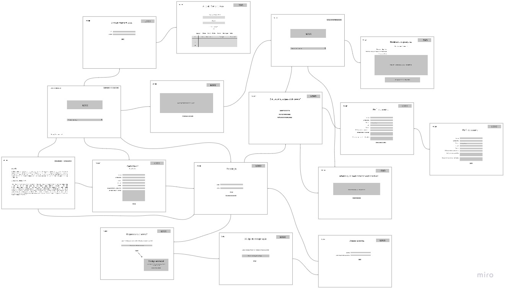

## Wireframes

Conforme fluxo de telas do projeto, apresentado no item anterior, as telas do sistema são discutidas em detalhes nos itens que se seguem. 

### Tela - Home-Page 

A tela de home-page mostra, em destaque, o logo de identidade visual do Medicamento Fácil. Abaixo, há uma linha de pesquisa, na qual o usuário deve digitar o seu endereço, para que a busca mostre os resultados mais próximos de sua localização. 

No bloco superior esquerdo, o usuário pode acessar a área do farmacêutico, cujo acesso estará disponível apenas para estes profissionais. Já o bloco superior direito é para acesso dos usuários finais, tanto para fazer login, quanto para criarem uma conta. 

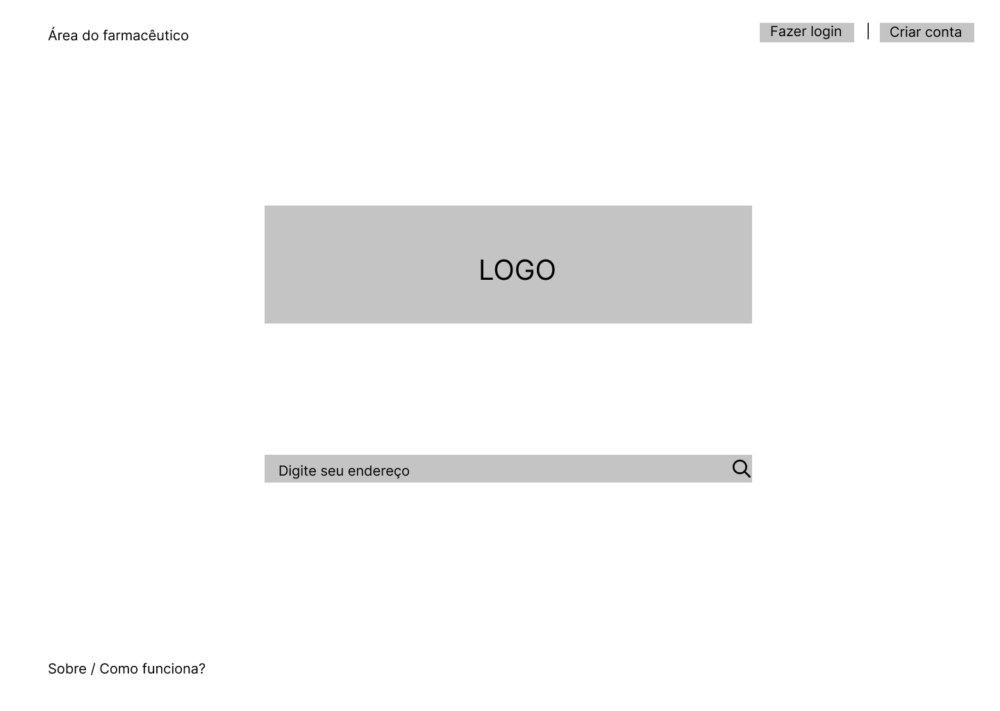

### Tela - Sobre/Como Funciona

Nessa tela o usuário pode entender melhor a proposta do site e como o mesmo funciona através dos títulos "Sobre" e "Como Funciona".

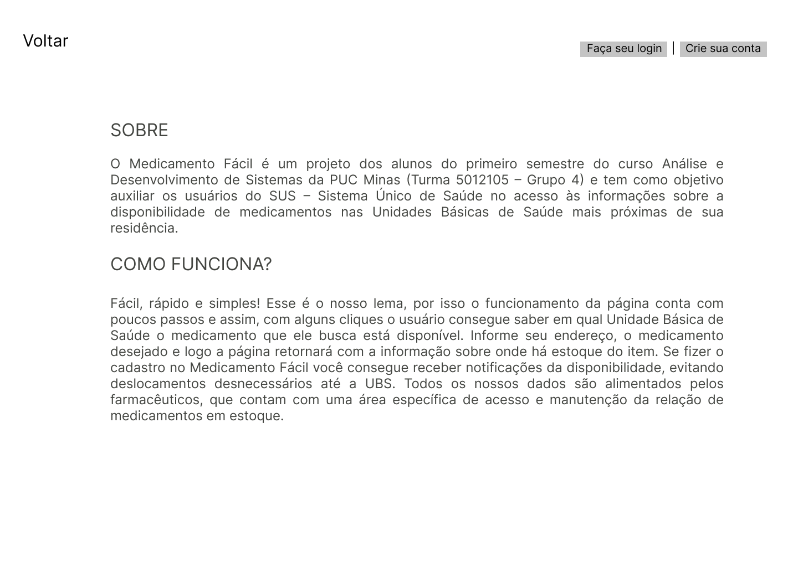

### Tela - Localização do usuário

Ao fazer a busca do seu endereço na tela "Home Page" o usuário será redirecionado a esta tela, na qual visualizará o mapa com o resultado da busca da sua localização e poderá confirmar o endereço no botão "Confirmar localização".

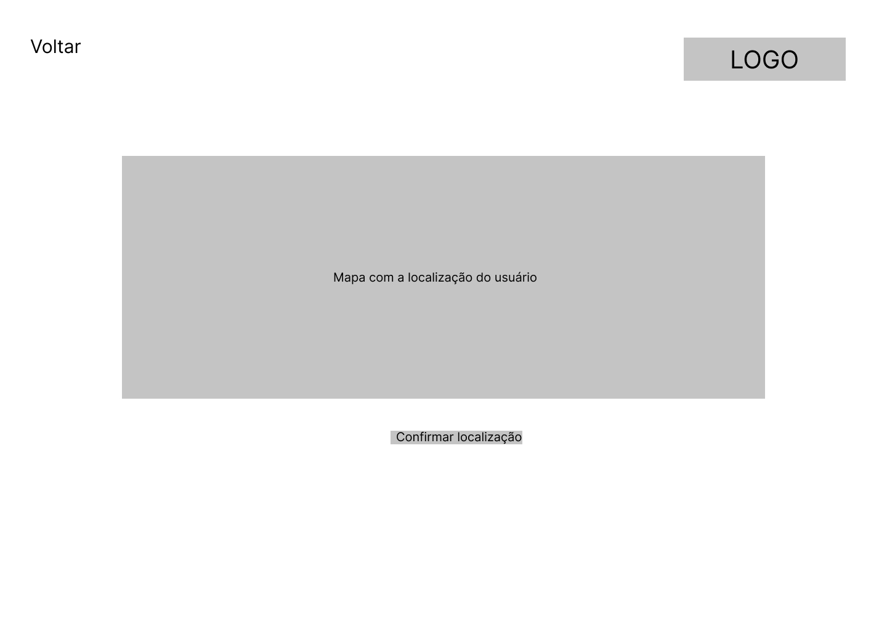

### Tela - Resultado da Pesquisa 

Assim que o usuário realiza a busca de um medicamento no tópico de pesquisa, ao clicar no botão “Ok”, ele é direcionado para uma tela que traz a relação dos medicamentos, as dosagens, o responsável pelo fornecimento, o prazo de entrega e o mapa com a localização da UBS mais próxima que possui o medicamento procurado. 
O usuário poderá compartilhar o resultado da busca e ver as informações de contato da UBS.

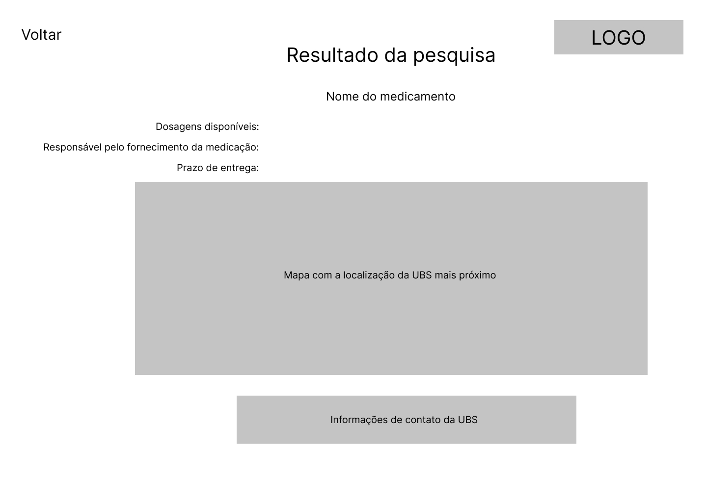

### Tela – Cadastre-se 

Ao clicar em “criar conta” na tela de home-page, o usuário será redirecionado a esta tela, na qual deverá preencher seus dados pessoais, criar uma senha e adicionar os medicamentos que utilizar. 

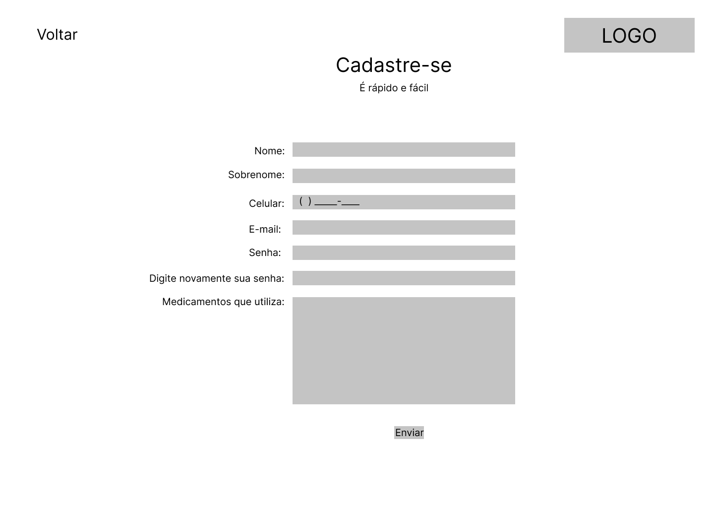

### Tela - Faça login 

Ao clicar em “fazer login” na tela de home-page, o usuário será redirecionado a esta tela, na qual deverá inserir seu e-mail cadastrado e senha, para acessar a área do usuário. Esta tela também apresenta o botão “esqueceu sua senha?” para o caso em que o usuário necessite recuperar o acesso. 

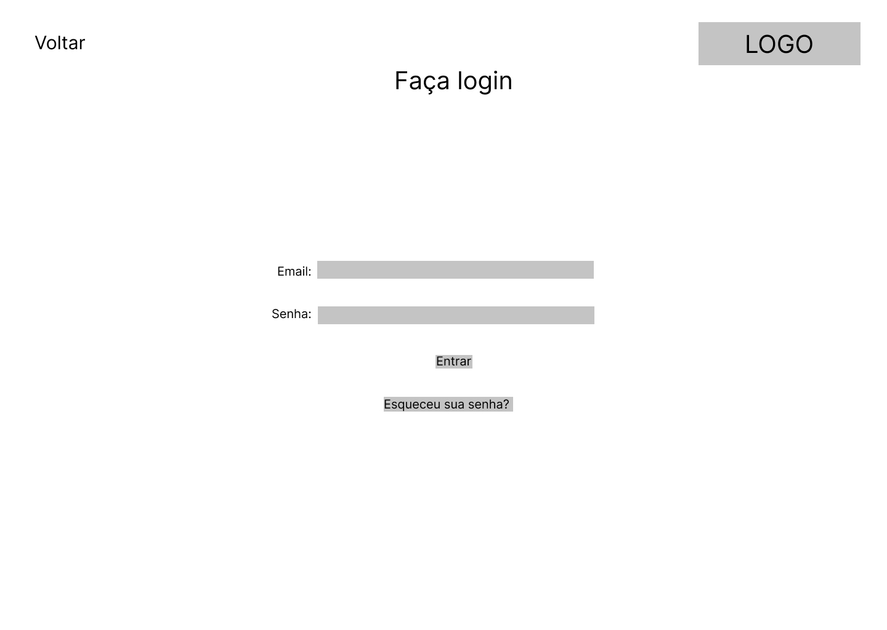

 ### Tela - Seleção de função pelo usuário
 
 A tela oferece ao usuário a possibilidade de escolher entre as duas funcionalidade do "Medicamento Fácil": 1) Notificar falta de medicamento ou 2) Pesquisar medicamento;

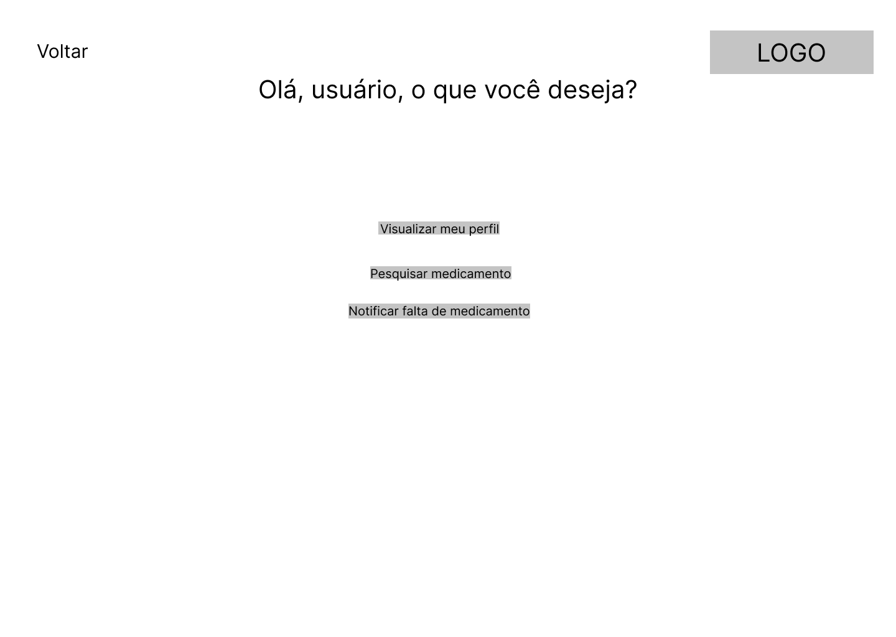

### Tela - Perfil do usuário

Ao clicar em "Visualizar meu perfil" na tela "Seleção de função pelo usuário", o usuário será redirecionado a esta página, onde pode consultar seus dados cadastrados e editá-los, além de visualizar suas requisições de medicamentos em falta.

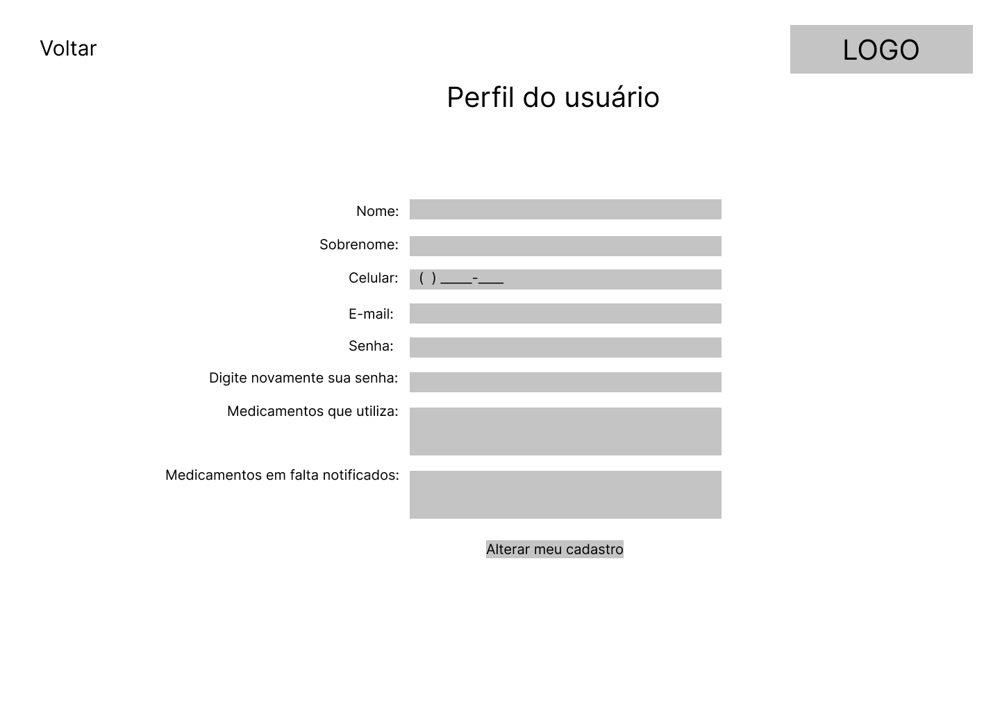

### Tela - Perfil do usuário - alterando cadastro

Ao selecionar a opção "Alterar meu cadastro" na tela anterior, o usuário pode editar seus dados e salvá-los.

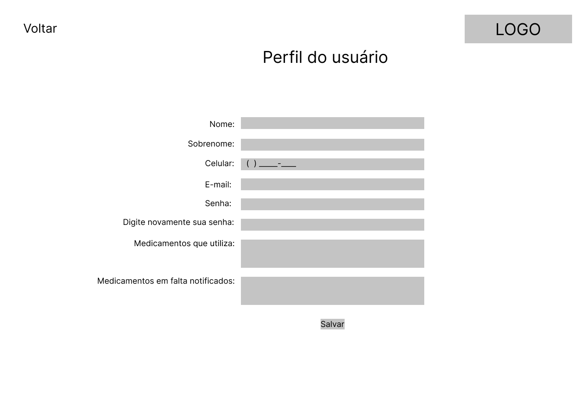

### Tela - Buscar medicamentos

Após escolher a opção "Pesquisar medicamentos" na tela "Seleção de função pelo usuário" o usuário será redirecionado para esta página na qual poderá fazer a busca pelo medicamento clicando no botão "Buscar medicamentos" e também notificar a falta de algum medicamento clicando no botão "Notificar falta de medicamento".

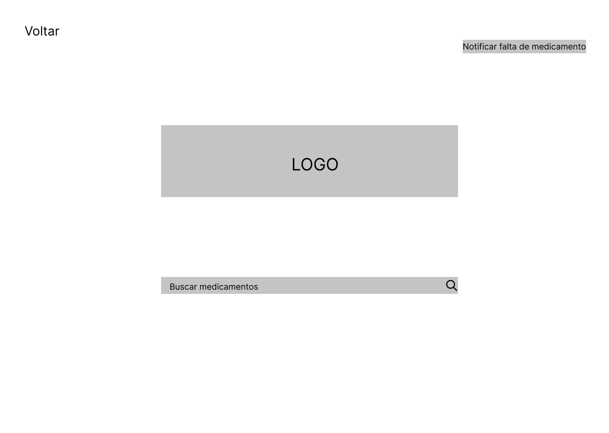

### Tela – Notificar a falta de medicamentos

Caso um usuário tenha verificado a indisponibilidade de um determinado medicamento, ele poderá notificar a falta através de uma requisição no sistema. 

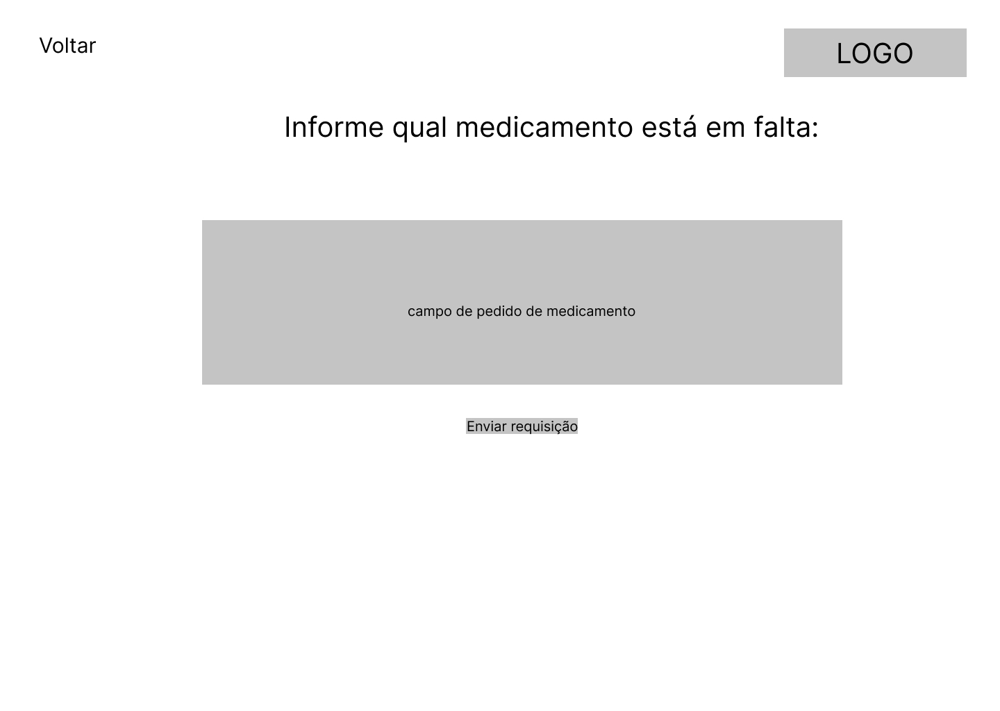

### Tela - Esqueceu sua senha 

Ao clicar em “Esqueceu sua senha” na tela "Faça login", o usuário será redirecionado a esta tela, na qual deverá inserir seu e-mail cadastrado para que o código de recuperação de senha lhe seja enviado. Caso o e-mail esteja correto e cadastrado, a tela apresenta a mensagem de confirmação de envio e o botão "recebi meu código" que redireciona o usuário à página "Código de recuperação". 

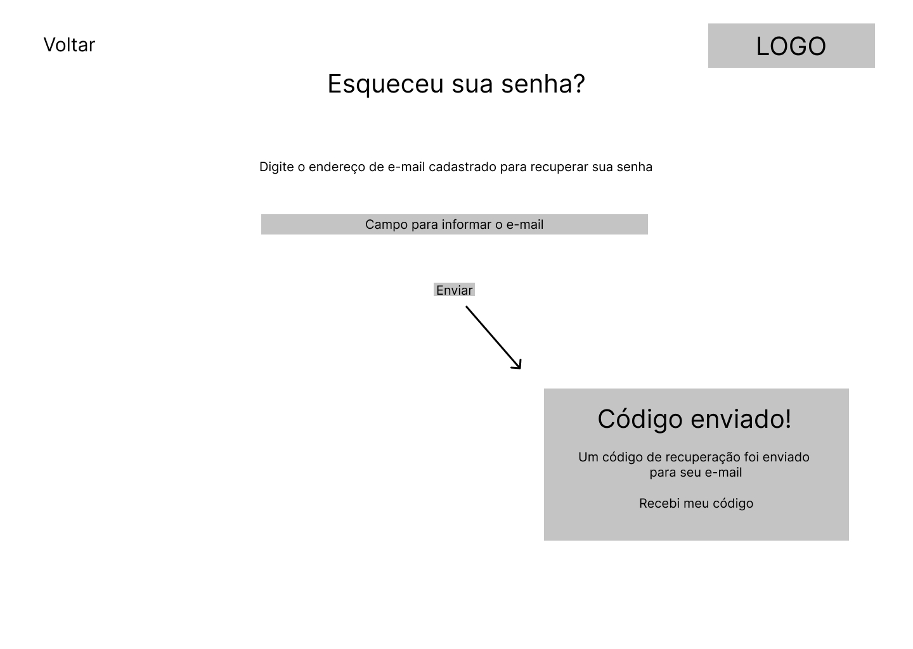

### Tela - Código de recuperação 

Ao clicar em “recebi meu código” na tela "Esqueceu sua senha", o usuário será redirecionado a esta tela, na qual deverá inserir o código de recuperação de senha recebido no campo disponível. A página apresenta o botão "enviar" que irá verificar se o código está correto, caso sim, o usuário será direcionado à pagina "Altere a senha".

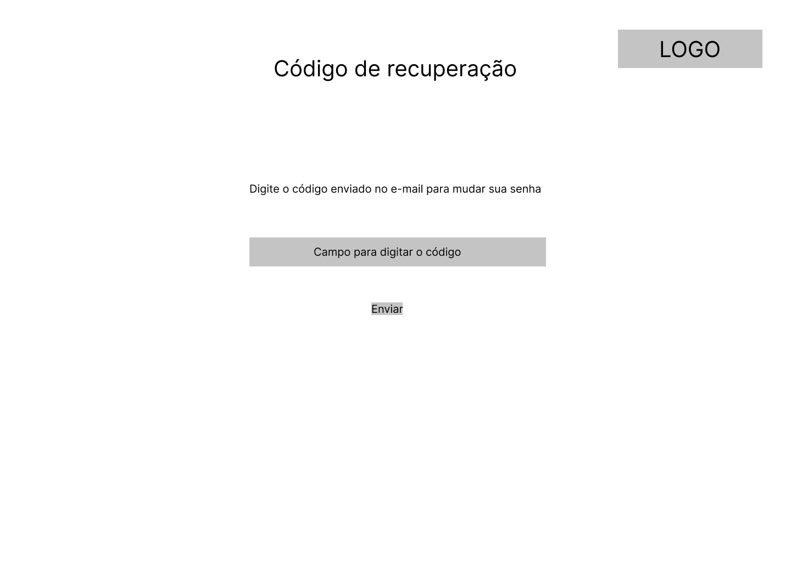

### Tela - Altere a senha 

Ao clicar em “enviar” na tela de "código de recuperação" e após verificação, o usuário será redirecionado a esta tela na qual deverá inserir a sua nova senha de acesso e confirmá-la novamente nos campos disponíveis.

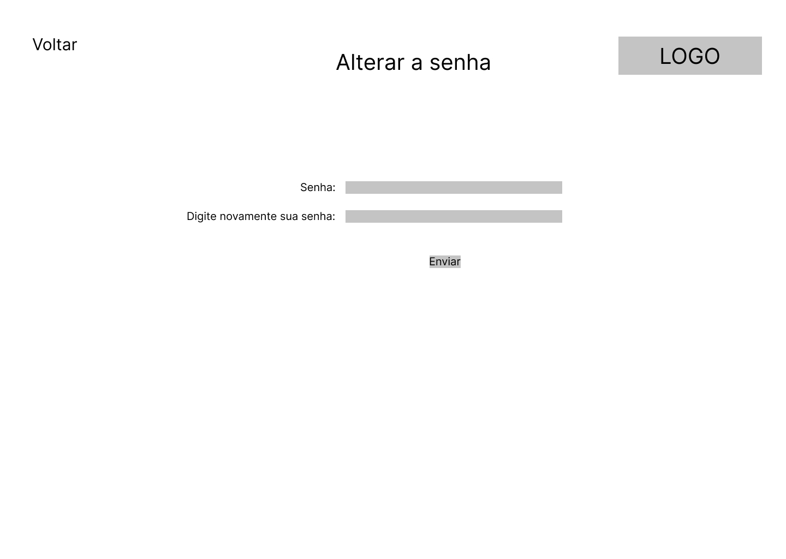

### Tela - Login do(a) Farmacêutico(a)

O(a) usuário(a) farmacêutico(a), responsável pelo controle de medicamentos da UBS - Unidade Básica de saúde, fará o login nessa tela, na qual será necessário informar e-mail e senha cadastrados. 

### Tela - Área do(a) Farmacêutico(a)

Após realizar o login, o profissional da farmácia visualizará as listas de medicamentos e doses para filtro, além da seção para marcação de SIM ou NÃO, para indicar se o medicamento está ou não disponível na UBS.

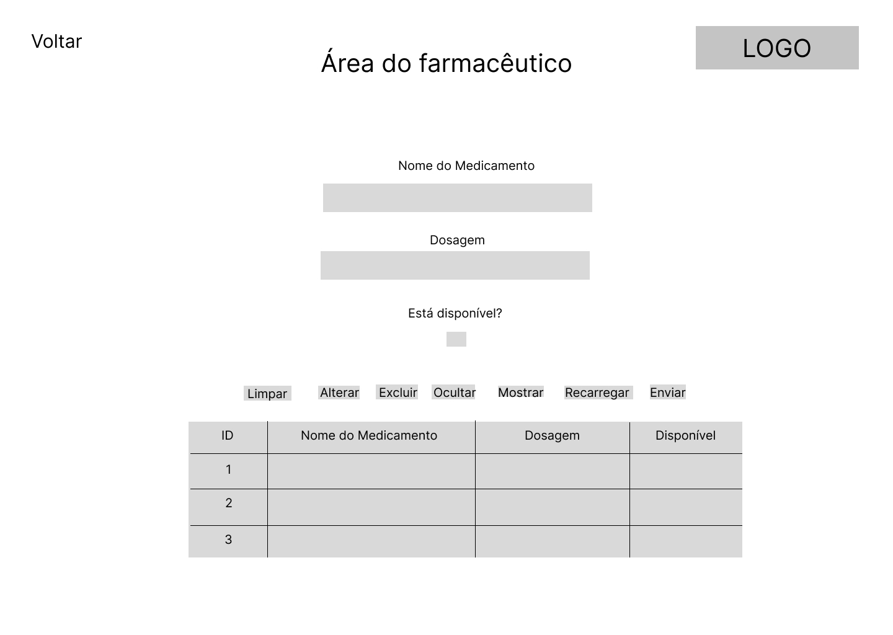
