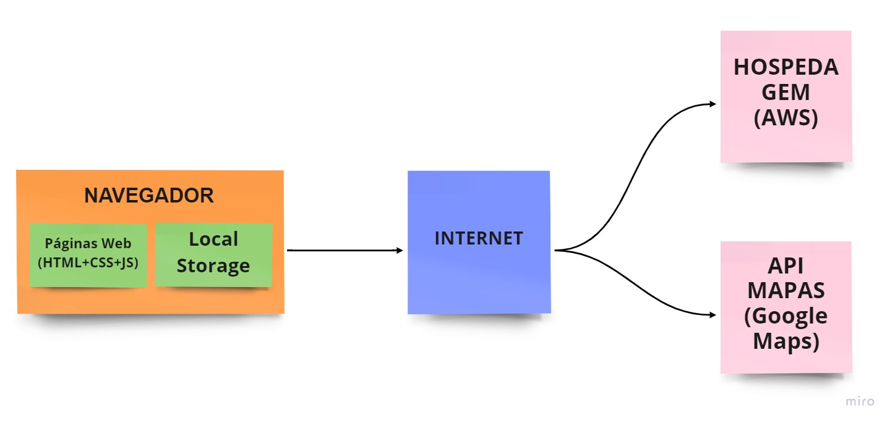

# Arquitetura da Solução

Nesta seção são apresentados os detalhes técnicos da solução criada pela equipe, tratando dos componentes que fazem parte da solução e do ambiente de hospedagem da aplicação. 

## Diagrama de componentes

Os componentes que fazem parte da solução são apresentados no diagrama da Figura abaixo. 

A solução implementada conta com os seguintes módulos:
- **Navegador** - Interface básica do sistema  
  - **Páginas Web** - Conjunto de arquivos HTML, CSS, JavaScript e imagens que implementam as funcionalidades do sistema.
   - **Local Storage** - Armazenamento mantido no Navegador, onde são implementados bancos de dados baseados em JSON. São eles: 
     - **Medicamentos** - Cadastro dos medicamentos, contendo o nome, dosagem e disponibilidade.
     - **Usuários** - Cadastro dos usuários do SUS, contendo nome, sobrenome, celular, e-mail e a senha; cadastro do farmacêutico de cada UBS.
     - **UBS** - Cadastro de todas as UBS do país, contendo o nome, a localização, as informações de contato e os responsáveis pelo fornecimento dos medicamentos.
     - **Medicamentos por usuário** - Cadastro da relação dos medicamentos de cada usuário.
 - **Hospedagem** - Local na Internet onde as páginas são mantidas e acessadas pelo navegador. 
 - **API Mapas** - Plataforma que permite o acesso à localização e aos mapas do Google Maps.
  
## Tecnologias Utilizadas

- Linguagens utilizadas para a base do desenvolvimento web do projeto: HTML, CSS e JavaScript. 

- IDEs de desenvolvimento: Visual Studio Code.

- Editor gráfico de vetor e prototipagem de projetos de design: Figma.

- Hospedagem da documentação e arquivos do projeto: Github.

- Plataforma de hospedagem em nuvem: AWS Amplify.

- Serviço de pesquisa e visualização de mapas e imagens de satélite para localização do usuário e da UBS: Google Mapas.

## Hospedagem

O site utiliza a plataforma GitHub Page como ambiente de hospedagem da aplicação. O site é mantido no ambiente do link: 

[Site do Projeto Medicamento Fácil](https://icei-puc-minas-pmv-ads.github.io/pmv-ads-2022-1-e1-proj-web-t5-medicamento-facil/src/index.html)

A publicação na plataforma é feita via git para o repositório remoto que se encontra no link: 

[Repositório Remoto](https://github.com/ICEI-PUC-Minas-PMV-ADS/pmv-ads-2022-1-e1-proj-web-t5-medicamento-facil.git)

