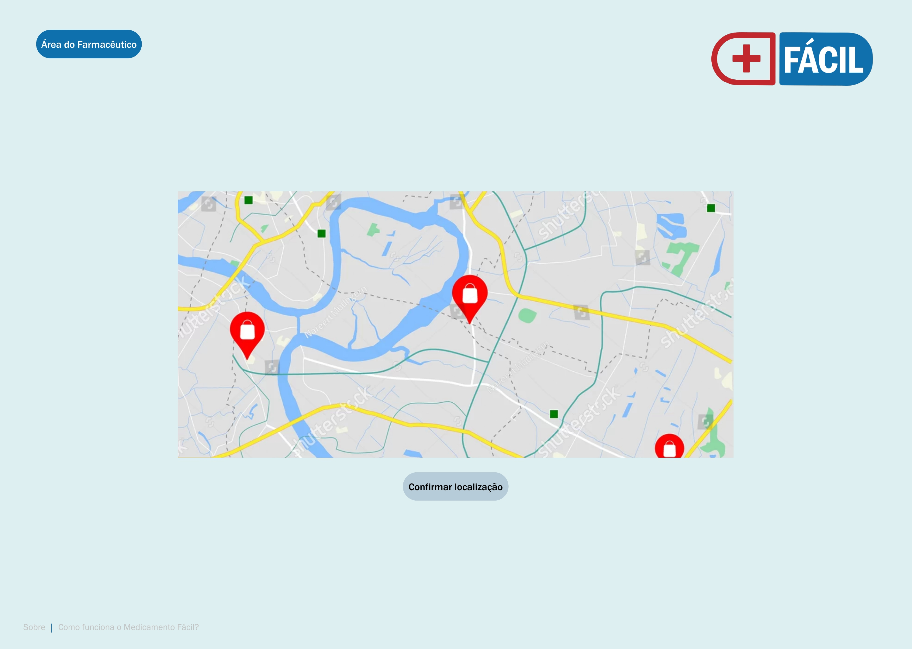

# Template padrão do site

A construção do design a ser utilizado na aplicação Medicamento Fácil foi feita através do Figma e tem como base o protótipo e o projeto de interface já apresentados. Para perimitir a responsividade do layout foram utilizadas estruturas do Bootstrap. 

## Tela Inicial

Com poucos elementos e focada na busca do usuário pela localidade, a Tela Inicial possui fundo azul claro (DEEFF1), com a logo do Medicamento Fácil centralizada na página, logo acima do buscador. Foram utilizadas as fontes Franklin Gothic Book e Franklin Gothic Medium na composição do buscador e também dos demais elementos textuais, bem como dos botões que indicam o fluxo para "Área do Farmacêutico", "Login" e "Criação de Conta". No rodapé o desing será mantido para todas as páginas, incluindo o link para a página Sobre e também para àrea explicativa sobre o Medicamento Fácil. Detalhe: os campos de interação com o usuário: buscador, resultados de busca e etc, apresentação sempre os cantos arredondados para serem similares à pilulas/medicamentos.

## Tela de Confimarção da Localização

Na tela de confirmação da localização mantem-se a mesma cor de fundo, o mesmo esquema de fontes, além do rodapá e do botão de acesso à "Área do Farmacêutico". A logo, em tamanho reduzido passa para o canto direito superior e servirá como direcionador para página inicial. As demais páginas da aplicação seguirão este padrão.

