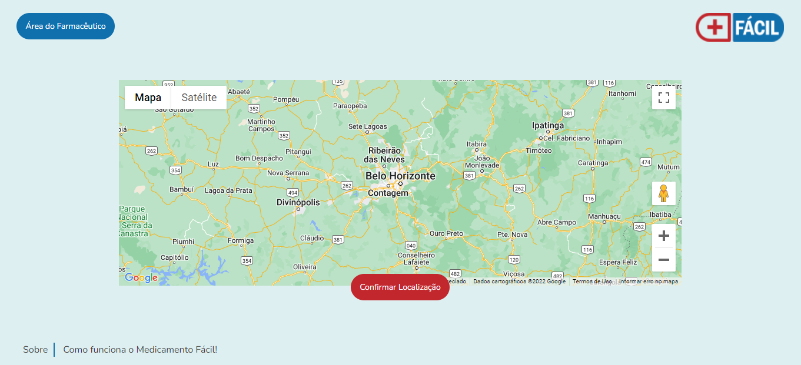

# Template padrão do site

A construção do design a ser utilizado na aplicação Medicamento Fácil foi feito através do Figma e tem como base o protótipo e o projeto de interface já apresentados. Para permitir a responsividade do layout foram utilizadas estruturas do Bootstrap. 

## Tela Inicial

Com poucos elementos e focada na busca do usuário pela localidade, a Tela Inicial possui fundo azul claro (DEEFF1), com a logo do Medicamento Fácil centralizada na página, logo acima do buscador. Foi utilizada a fonte Nunito na composição do buscador e também dos demais elementos textuais, bem como dos botões que indicam o fluxo para "Área do Farmacêutico", "Login" e "Criação de Conta". No rodapé o design será mantido para todas as páginas, incluindo o link para a página "Sobre" e também para área explicativa sobre o "Medicamento Fácil". Ainda, os campos de interação com o usuário: buscador, resultados de busca, dentre outros, apresentarão sempre os cantos arredondados para serem similares às pílulas/medicamentos.

## Tela de Confirmação da Localização

Na tela de Confirmação da Localização mantém-se a mesma cor de fundo, o mesmo esquema de fontes, além do rodapé e do botão de acesso à "Área do Farmacêutico". A logo, em tamanho reduzido, passa para o canto direito superior e servirá como direcionador para página inicial. As demais páginas da aplicação seguirão este padrão.

## Tela de Cadastro de usuários

Na tela de Cadastro mantém-se a mesma cor de fundo, o mesmo esquema de fontes, além do rodapé. Também apresenta um botão para voltar à página anterior. A logo, em tamanho reduzido, passa para o canto direito superior e servirá como direcionador para página inicial. As demais páginas da aplicação seguirão este padrão.

