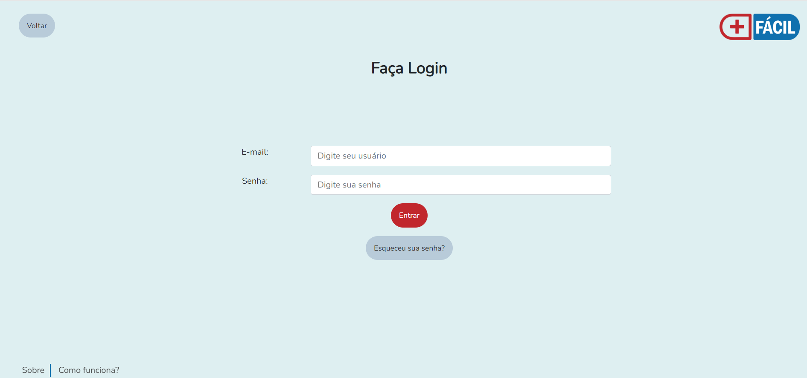
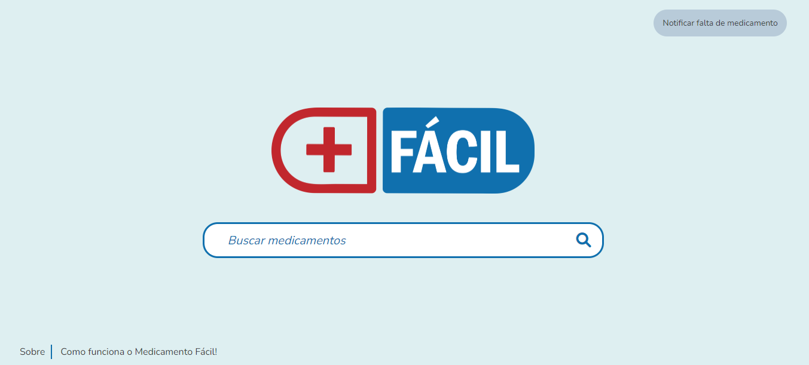
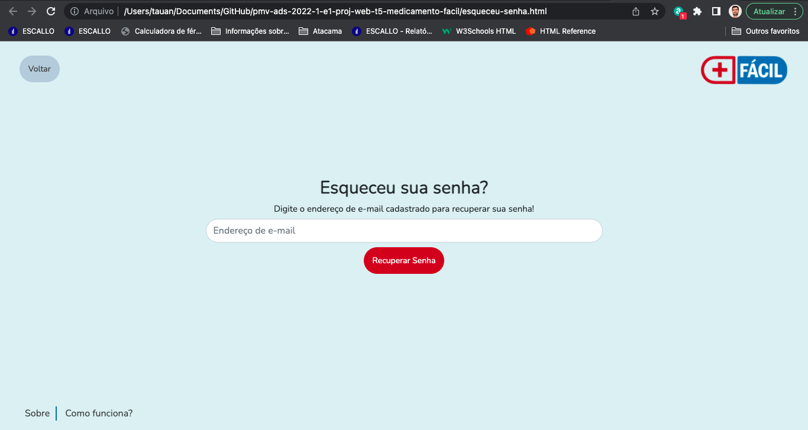
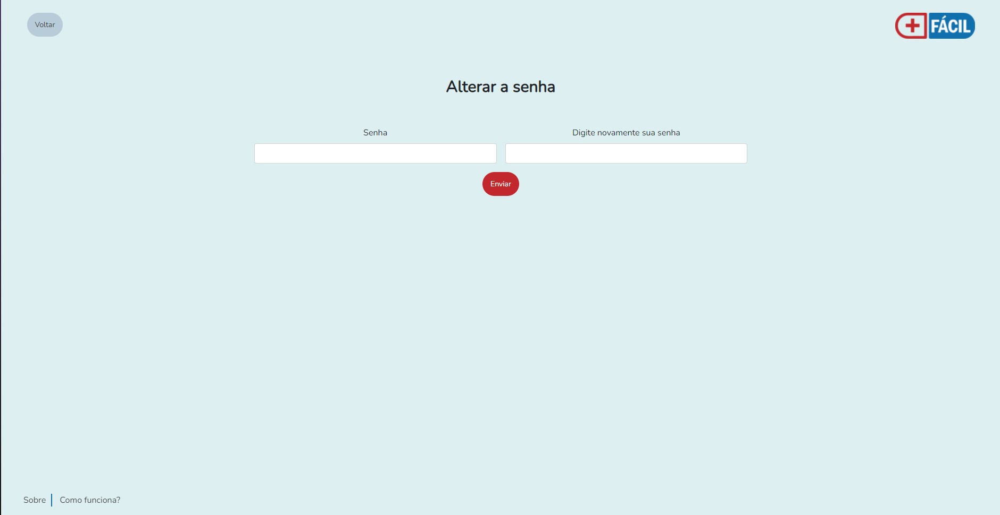
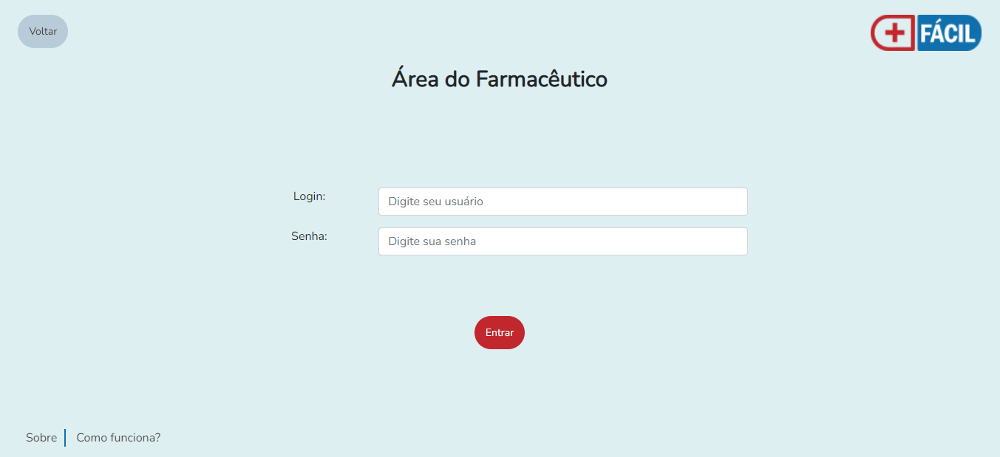

# Programação de Funcionalidades

Nesta seção são apresentadas as telas desenvolvidas para cada uma das funcionalidades do sistema.

Abra um navegador de Internet e informe a seguinte URL: https://icei-puc-minas-pmv-ads.github.io/pmv-ads-2022-1-e1-proj-web-t5-medicamento-facil/src/index

## Tela de Cadastro (RF-06)

A Tela de Cadastro do sistema apresenta campos nos quais o usuário deverá preencher seus dados para realizar o cadastro. Esta tela também apresenta os ícones "sobre" e "como funciona o medicamento fácil". 




### Requisitos atendidos

RF-06 - O site deve ter uma área personalizada, na qual o usuário deverá acessar com login e senha. Nesta área, o usuário irá cadastrar seu e-mail, celular e os medicamentos que utiliza, sendo notificado assim que os medicamentos estiverem disponíveis.

### Artefatos da funcionalidade 

- cadastro.html
- cadastro.js
- template.css
- logo.png

### Estrutura de Dados

let nome = document.querySelector('#nome')
let labelNome = document.querySelector('#labelNome')
let validNome = false

let sobrenome = document.querySelector('#sobrenome')
let labelSobrenome = document.querySelector('#labelSobrenome')
let validSobrenome = false

let celular = document.querySelector('#celular')
let labelCelular = document.querySelector('#labelCelular')
let validCelular = false

let email = document.querySelector('#email')
let labelEmail = document.querySelector('#labelEmail')
let validEmail = false

let senha = document.querySelector('#senha')
let labelSenha = document.querySelector('#labelSenha')
let validSenha = false

let confirmarSenha = document.querySelector('#confirmarSenha')
let labelConfirmarSenha = document.querySelector('#labelConfirmarSenha')
let validConfirmarSenha = false

nome.addEventListener('keyup', ()=>{
    if(nome.value.length < 2){
        labelNome.setAttribute('style', 'color: red')
        labelNome.innerHTML =  'Nome *Insira no mínimo 2 caracteres'
        validNome = false
    } else {
        labelNome.setAttribute('style', 'color: green')
        labelNome.innerHTML = 'Nome'
        validNome = true
    }
})

sobrenome.addEventListener('keyup', ()=>{
    if(sobrenome.value.length < 2){
        labelSobrenome.setAttribute('style', 'color: red')
        labelSobrenome.innerHTML =  'Sobrenome *Insira no mínimo 2 caracteres'
        validSobrenome = false
    } else {
        labelSobrenome.setAttribute('style', 'color: green')
        labelSobrenome.innerHTML = 'Sobrenome'
        validSobrenome = true
    }
})

celular.addEventListener('keyup', ()=>{
    if(celular.value.length <= 8){
        labelCelular.setAttribute('style', 'color: red')
        labelCelular.innerHTML =  'Celular *Insira 9 dígitos'
        validCelular = false
    } else {
        labelCelular.setAttribute('style', 'color: green')
        labelCelular.innerHTML = 'Celular'
        validCelular = true
    }
})

email.addEventListener('keyup', ()=>{
    if(email.value.length <= 8){
        labelEmail.setAttribute('style', 'color: red')
        labelEmail.innerHTML =  'E-mail *Insira um e-mail válido'
        validEmail = false
    } else {
        labelEmail.setAttribute('style', 'color: green')
        labelEmail.innerHTML = 'E-mail'
        validEmail = true
    }
})

senha.addEventListener('keyup', ()=>{
    if(senha.value.length <= 5){
        labelSenha.setAttribute('style', 'color: red')
        labelSenha.innerHTML =  'Senha *Insira no mínimo 6 caracteres'
        validSenha = false
    } else {
        labelSenha.setAttribute('style', 'color: green')
        labelSenha.innerHTML = 'Senha'
        validSenha = true
    }
})

confirmarSenha.addEventListener('keyup', ()=>{
    if(senha.value != confirmarSenha.value){
        labelConfirmarSenha.setAttribute('style', 'color: red')
        labelConfirmarSenha.innerHTML =  'Senha *As senhas devem ser iguais'
        validConfirmarSenha = false
    } else {
        labelConfirmarSenha.setAttribute('style', 'color: green')
        labelConfirmarSenha.innerHTML = 'Confirmar senha'
        validConfirmarSenha = true
    }
})

function cadastrar(){ 
    if (validNome == true  && validSobrenome == true && validCelular == true && validEmail == true  && validSenha == true && validConfirmarSenha == true) { 
        
        let listaUser = JSON.parse(localStorage.getItem('listaUser') || '[]')
        listaUser.push(
            {
                nomeCad:nome.value,
                sobrenomeCad: sobrenome.value,
                celularCad: celular.value,
                emailCad: email.value,
                senhaCad: senha.value,
            }

          
        )
    
        //salvando a lista de usuário no local storage

        localStorage.setItem('listaUser', JSON.stringify(listaUser))
        alert ('Cadastro realizado com sucesso!')
        window.location.href = 'login.html'
       

    } else {
        alert ('Favor preencher os campos!')
    }
}

### Instruções de acesso

A Tela de Cadastro é a exibida após o usuário clicar em "Crie sua conta".


## Tela de Login (RF-06)

A Tela de Login do sistema apresenta campos nos quais o usuário deverá digitar e-mail e senha cadastrados para acessar a área do usuário. Esta tela também apresenta o botão “esqueceu sua senha?” para o caso em que o usuário necessite recuperar o acesso. Também dispõe dos ícones "sobre" e "como funciona o medicamento fácil". 


### Requisitos atendidos

RF-06 - O site deve ter uma área personalizada, na qual o usuário deverá acessar com login e senha. Nesta área, o usuário irá cadastrar seu e-mail, celular e os medicamentos que utiliza, sendo notificado assim que os medicamentos estiverem disponíveis.

### Artefatos da funcionalidade 

- login.html
- login.js
- template.css
- logo.png

### Estrutura de Dados

        function logar ()
        {
            var login = document.getElementById('login').value;
            var senha = document.getElementById('senha').value;
            if (login == "carolina@hotmail.com" && senha == "1234"){
                location.href = "area-usuario.html";
            } else {
                alert ('Usuário ou senha incorretos. Tente novamente!');
            }
        }


### Instruções de acesso

A Tela de Login é a exibida após o usuário clicar em "Faça Login".


## Tela Inicial (RF-01)

A Tela Inicial do sistema apresenta apresenta um buscador centralizado, no qual o usuário deverá digitar seu endereço e a fim de direcionar a buscar de medicamentos à Unidade Básica de Saúde mais próxima. Esta tela ainda permite que o usuário faça cadastro ou login, bem como acesso à Área do Farmacêutico. Também dispõe dos icones "sobre" e "como funciona o medicamento fácil". Para facilidade de acesso foi incorporado a função de autocompletar o endereço enquanto o usuário digita.


### Requisitos atendidos 

RF-01 -  O site deve apresentar na página principal um buscador no qual o usuário irá digitar seu endereço.

### Artefatos da funcionalidade 

- index.html
- index.js
- template.css
- logo.png

### Estrutura de Dados 

        let endereco_google;
        function initAutocomplete(){
        endereco_google = new google.maps.places.Autocomplete(
            document.getElementById('autocomplete'),
            {
                types: ['address'],
                componentRestrictions: {'country': ['BR']},
                fields: ['address_components']
            })   ;
        }


### Instruções de acesso 

A Tela Inicial é a primeira funcionalidade exibida pelo aplicativo. 

## Tela de Busca de Medicamentos (RF-03)

A Tela de Busca de Medicamentos do sistema apresenta apresenta um buscador centralizado, no qual o usuário deverá digitar os medicamentos de interesse. Esta tela ainda permite que o usuário notifique a falta de um medicamento. Também dispõe dos icones "sobre" e "como funciona o medicamento fácil".



### Requisitos atendidos 

RF-03 -  O site deve apresentar uma página com um buscador no qual o usuário irá digitar os medicamentos buscados.

### Artefatos da funcionalidade 

- buscar-medicamento.html
- template.css
- logo.png

### Artefatos da funcionalidade 

- buscar-medicamento.html
- MedicamentoControlador.js
- logo.png

### Estrutura de Dados 
Acesse a pasta scr/app/entidades e veja Medicamento.js, depois vá em src/app/mocks e acesse medicamento.mock.js e medicamento.mock.min.js

```
export const medicamentos = [{
        "principioAtivo": "ACEBROFILINA",
        "laboratorioNome": "GERMED FARMACEUTICA LTDA",
        "nome": "ACEBROFILINA",
        "apresentacao": "10 MG/ML XPE CT FR PLAS AMB X 120 ML + COP",
        "tarja": "TARJA VERMELHA"
    }, {
        "principioAtivo": "ACEBROFILINA",
        "laboratorioNome": "GERMED FARMACEUTICA LTDA",
        "nome": "ACEBROFILINA",
        "apresentacao": "10 MG/ML XPE CT FR VD AMB X 120 ML + COP",
        "tarja": "TARJA VERMELHA"
    }...
```

### Instruções de acesso 

A Tela de Busca de Medicamentos é a exibida após a confirmação de endereço. 


## Tela Notificar falta de medicamento (RF-09)

A Tela Notificar falta medicamento apresenta uma caixa de texto centralizada onde o usuário poderá preencher o nome do medicamento que está em falta e em seguida enviar clicando no botão "Enviar requisição" logo abaixo. 


### Requisitos atendidos 

RF-09 -  O site deve permitir que o próprio usuário notifique a falta de um determinado medicamento.

### Artefatos da funcionalidade 

- notificar-medicamento.html
- notificar.js
- template.css
- logo.png

### Estrutura de Dados 

    let nomeMedicamento = document.getElementById("nomeMedicamento");

    let dados = JSON.parse(localStorage.getItem("dadosMedicamento"));

    if(dados == null){
         localStorage.setItem("dadosMedicamento", "[]");
         dados = [];
    }

    let auxRegistro = {
        nome: nomeMedicamento.value
    
    }

    dados.push(auxRegistro);

    localStorage.setItem("dadosMedicamento", JSON.stringify(dados));
    alert("Requisição de medicamento enviada!")

    nomeMedicamento.value = "";
    }

### Instruções de acesso

A Tela de Área do usuário é a exibida após o usuário clicar em "Fazer Login" e enviar o formulário com o e-mail e senha.

## Tela Esqueceu sua senha (RF-10)

A Tela Esqueceu sua senha permite que o usuário preencha seu e-mail para fazer a recuperação de senha. A tela ainda conta com o itens "Sobre" e "Como funciona?", nos quais o usuário, ao passar o mouse acessa os balões com as informações correspondentes.



### Requisitos atendidos 

RF-10 -  O site deve permitir que o usuário recupere sua senha em caso de esquecimento.

### Artefatos da funcionalidade 

- esqueceu-senha.html
- template.css
- logo.png

### Estrutura de Dados 
                        <ul class="lista-horizontal">
                        <li class="tipSobre" data-tooltip="Nascido para ser uma ferramenta de suporte do usuário do Sistema Único de Saúde - SUS, o Medicamento Fácil fo desenvolvimento por um grupo de aluos do curso de Tecnologia e Desenvolvimento e Análise de Sistemas da PUC Minas, durante o primeiro semestre de 2022.">Sobre</li>
                        <li class="tipComo" data-tooltip="O Medicamento Fácil conta com uma base de dados alimentada diariamente pelos profissionais das Unidades Básicas de Saúde - UBS, assim você consegue buscar o medicamento que você precisa através do nosso buscador de endereços.">Como funciona?</li>
                    </ul>

### Instruções de acesso

A Tela da esquecimento de senha é exibida após o usuário clicar em "esqueceu sua senha?" na tela de login.

## Tela Alterar senha (RF-10)

A Tela Alterar senha apresenta dois campos:  "Senha" - onde o usuário preencherá com a nova senha e "Digite novamente sua senha" - onde deverá confirmar a senha escolhida e confirmar clicando no botão "Enviar" logo abaixo.



### Requisitos atendidos 

RF-10 -  O site deve permitir que o usuário recupere sua senha em caso de esquecimento.

### Artefatos da funcionalidade 

- alterar-senha.html
- esqueceu-senha.html
- template.css
- recuperar-senha.css
- logo.png

### Estrutura de Dados 
                        <button type="submit" class="btn botao-secundario" onclick="alert('Senha alterada com sucesso!');">
                            Enviar
                        </button>


### Instruções de acesso

A Tela da alterar a senha é a exibida após o usuário receber o codigo de recuperação.


## Tela Login do Farmacêutico (RF-05)

A Tela de Login do Farmacêutico apresenta os campos de login e senha, nos quais o farmacêutico deverá inserir seus dados. Esta tela ainda permite retornar à tela inicial. Também dispõe dos icones "sobre" e "como funciona o medicamento fácil".



### Requisitos atendidos 

RF-05 -  O site deve ter uma área de login do farmacêutico, na qual ele irá atualizar o estoque de medicamentos disponíveis pela farmácia da UBS.

### Artefatos da funcionalidade 

- login-farmaceutico.html
- template.css
- logo.png

### Estrutura de Dados 

        function logar()
        {
            var login = document.getElementById('login').value;
            var senha = document.getElementById('senha').value;
            if (login == "farmaceutico@ubs.com" && senha == "1234"){
                location.href = "area-do-farmaceutico.html";
            } else {
                alert ('Usuário ou senha incorretos! \nTente novamente.');
            }
        }


### Instruções de acesso 

A Tela de Login do Farmacêutico é direcionada ao clicar no botão "Área do Farmacêutico" na home page. 


