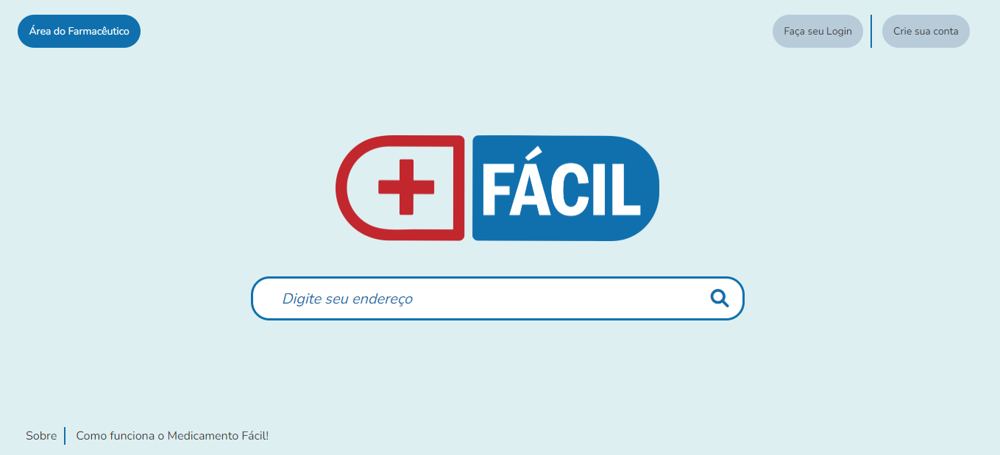
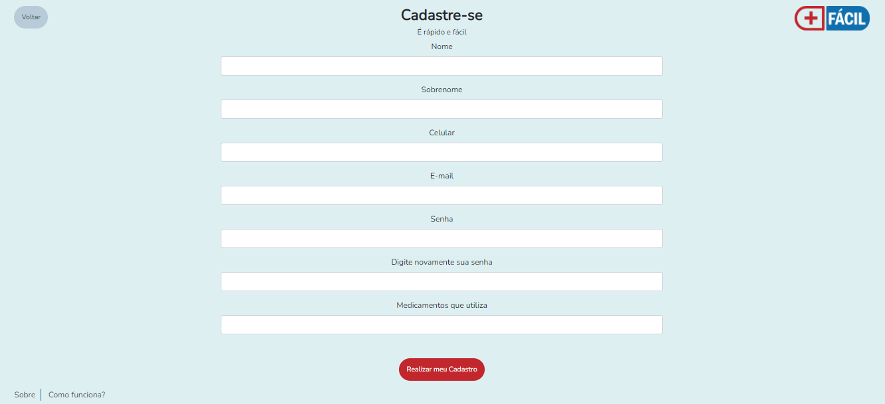

# Programação de Funcionalidades

Nesta seção são apresentadas as telas desenvolvidas para cada uma das funcionalidades do sistema.

## Tela Inicial (RF-01)

A Tela Inicial do sistema apresenta apresenta um buscador centralizado, no qual o usuário deverá digitar seu endereço a fim de direcionar a buscar de medicamentos à Unidade Básica de Saúde mais próxima. Esta tela ainda permite que o usuário faça cadastro ou login, bem como acesso à Área do Farmacêutico. Também dispõe dos icones "sobre" e "como funciona o medicamento fácil".

### Requisitos atendidos 

RF-01 -  O site deve apresentar na página principal um buscador no qual o usuário irá digitar seu endereço.

### Artefatos da funcionalidade 

- index.html
- base.css
- logo.png

### Estrutura de Dados 

<!DOCTYPE html>
<html>
<head>
    <link href="css/bootstrap.min.css" rel="stylesheet" />
    <link rel="preconnect" href="https://fonts.googleapis.com">
    <link rel="preconnect" href="https://fonts.gstatic.com" crossorigin>
    <link href="https://fonts.googleapis.com/css2?family=Nunito&display=swap" rel="stylesheet">
    <link href="https://cdnjs.cloudflare.com/ajax/libs/font-awesome/6.1.1/css/all.min.css" rel="stylesheet">
    <link href="css/template.css" rel="stylesheet" />
    <meta charset="UTF-8">
    <title>Medicamento Fácil. Simples. Rápido.</title>
</head>
<body>
    <header>
         
        

            

                <button id="button1" class="btn botao-principal">Área do Farmacêutico</button>
            

            

                <ul class="lista-horizontal">
                    <li>
                        <button type="button" class="btn botao-padrao">Faça seu Login</button>
                    </li>
                    <li>
                        <a href="cadastro.html">
                            <button type="button" class="btn botao-padrao">Crie sua conta</button>
                        </a>
                    </li>
                </ul>
            

        

    </header>
    <main>
        

        

            

            

                
            

            

        

        

          
        

            

            

                

                    <form method="get" action="mapa.html">
                        <input class='form-control buscador' type="text" placeholder="Digite seu endereço" />
                        <button type="submit" class="lupa">
                            <i class="fa-solid fa-magnifying-glass"></i>
                        </button>
                    </form>
                

            

            

        

    </main>
    <footer class="row">
        

            <nav>
                <ul class="lista-horizontal">
                    <li>Sobre</li>
                    <li>Como funciona o Medicamento Fácil!</li>
                </ul>
            </nav>
        

    </footer>
    
</body>
</html>

### Instruções de acesso 

Abra um navegador de Internet e informe a seguinte URL: XXXXX

A Tela Inicial é a primeira funcionalidade exibida pelo aplicativo. 

## Tela de Busca de Medicamentos (RF-02)

A Tela de Busca de Medicamentos do sistema apresenta apresenta um buscador centralizado, no qual o usuário deverá digitar os medicamentos de interesse. Esta tela ainda permite que o usuário notifique a falta de um medicamento. Também dispõe dos icones "sobre" e "como funciona o medicamento fácil".

### Requisitos atendidos 

RF-02 -  O site deve apresentar uma página com um buscador no qual o usuário irá digitar os medicamentos buscados.

### Artefatos da funcionalidade 

- index.html
- template.css
- logo.png

### Estrutura de Dados 

<!DOCTYPE html>
<html>

<head>
    <link href="css/bootstrap.min.css" rel="stylesheet" />

    <link rel="preconnect" href="https://fonts.googleapis.com">
    <link rel="preconnect" href="https://fonts.gstatic.com" crossorigin>
    <link href="https://fonts.googleapis.com/css2?family=Nunito&display=swap" rel="stylesheet">
    <link href="https://cdnjs.cloudflare.com/ajax/libs/font-awesome/6.1.1/css/all.min.css" rel="stylesheet">

    <link href="css/template.css" rel="stylesheet" />

    <meta charset="UTF-8">
    <title>Medicamento Fácil. Simples. Rápido.</title>
</head>

<body>
    <header>
         
        

            

            

            

                <ul class="lista-horizontal">
                    <li>
                        <button type="button" class="btn botao-padrao">Notificar falta de medicamento</button>
                    </li>
                </ul>
            

        

    </header>
    <main>
        

        

            

            

                
            

            

        

        

          
        

            

            

                

                    <form method="get" action="mapa.html">
                        <input class='form-control buscador' type="text" placeholder="Buscar medicamentos" />
                        <button type="submit" class="lupa">
                            <i class="fa-solid fa-magnifying-glass"></i>
                        </button>
                    </form>
                

            

            

        

    </main>
    <footer class="row">
        

            <nav>
                <ul class="lista-horizontal">
                    <li>Sobre</li>
                    <li>Como funciona o Medicamento Fácil!</li>
                </ul>
            </nav>
        

    </footer>
    
</body>

</html>

### Instruções de acesso 

Abra um navegador de Internet e informe a seguinte URL: XXXXX

A Tela de Busca de Medicamentos é a exibida após a confirmação de endereço. 

## Tela Cadastro (RF-05)

A Tela de Busca de Medicamentos do sistema apresenta apresenta um buscador centralizado, no qual o usuário deverá digitar os medicamentos de interesse. Esta tela ainda permite que o usuário notifique a falta de um medicamento. Também dispõe dos icones "sobre" e "como funciona o medicamento fácil".

### Requisitos atendidos 

RF-05 -  O site deve ter uma área personalizada, na qual o usuário deverá acessar com login e senha. Nesta área, o usuário irá cadastrar seu e-mail, celular e os medicamentos que utiliza, sendo notificado assim que os medicamentos estiverem disponíveis.

### Artefatos da funcionalidade 

- cadastro.html
- template.css
- logo.png

### Estrutura de Dados 

<!DOCTYPE html>
<html>
<head>
    <link href="css/bootstrap.min.css" rel="stylesheet" />
    <link rel="preconnect" href="https://fonts.googleapis.com">
    <link rel="preconnect" href="https://fonts.gstatic.com" crossorigin>
    <link href="https://fonts.googleapis.com/css2?family=Nunito&display=swap" rel="stylesheet">
    <link href="https://cdnjs.cloudflare.com/ajax/libs/font-awesome/6.1.1/css/all.min.css" rel="stylesheet">
    <link href="css/template.css" rel="stylesheet" />
    <meta charset="UTF-8">
    <title>Medicamento Fácil. Simples. Rápido.</title>
</head>
<body class="ativar-rolamento">
    <header>
         
        

            

                <a href="index.html">
                    <button id="button1" class="btn botao-padrao">Voltar</button>
                </a>
            

            

                
            

        

    </header>
    <main class="text-center">
        

            

                <h1>Cadastre-se</h1>
                <h2>É rápido e fácil</h2>                
            

        

        

            

            

                <form class="row g-3">
                    

                        <label for="inputName" class="form-label">Nome</label>
                        <input type="text" class="form-control" id="inputName" >
                    

                    

                        <label for="inputLastname" class="form-label">Sobrenome</label>
                        <input type="text" class="form-control" id="inputLastname" >
                    

                    

                        <label for="inputPhone" class="form-label">Celular</label>
                        <input type="number" class="form-control" id="inputPhone">
                    

                    

                        <label for="inputEmail" class="form-label">E-mail</label>
                        <input type="email" class="form-control" id="inputEmail">
                    

                    

                        <label for="inputPassword" class="form-label">Senha</label>
                        <input type="password" class="form-control" id="inputPassword">
                    

                    

                        <label for="inputPassword2" class="form-label">Digite novamente sua senha</label>
                        <input type="password" class="form-control" id="inputPassword2">
                    

                    

                        <label for="inputMed" class="form-label">Medicamentos que utiliza</label>
                        <input type="text" class="form-control" id="inputMed">
                    

                    

                    

                      
                    

                        <button type="submit" class="btn botao-secundario">Realizar meu Cadastro</button>
                    

                </form>
            

            

        

    </main>
    <footer class="row">
        

            <nav>
                <ul class="lista-horizontal">
                    <li>Sobre</li>
                    <li>Como funciona?</li>
                </ul>
            </nav>
        

    </footer>
    
</body>
</html>

### Instruções de acesso 

Abra um navegador de Internet e informe a seguinte URL: XXXXX

A Tela de Cadastro é a exibida após o usuário clicar em "Crie sua Conta".

### Tela de Login (RF-05)

A Tela de Login do sistema apresenta um buscador centralizado, no qual o usuário deverá digitar e-mail e senha cadastrados para acessar a área do usuário. Esta tela também apresenta o botão “esqueceu sua senha?” para o caso em que o usuário necessite recuperar o acesso. Também dispõe dos ícones "sobre" e "como funciona o medicamento fácil".
