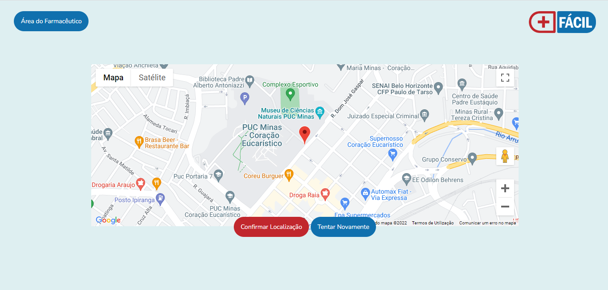
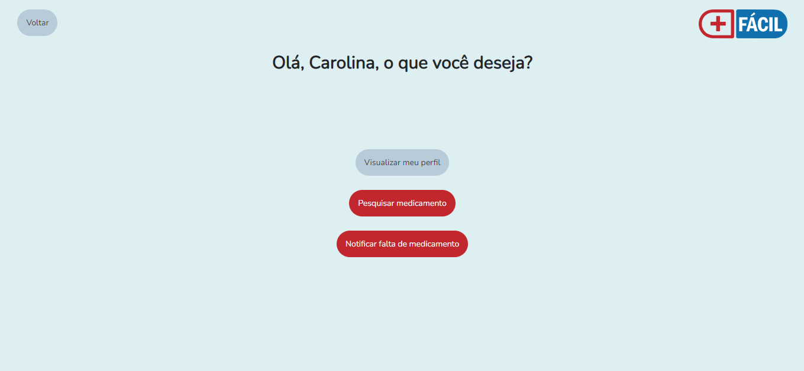
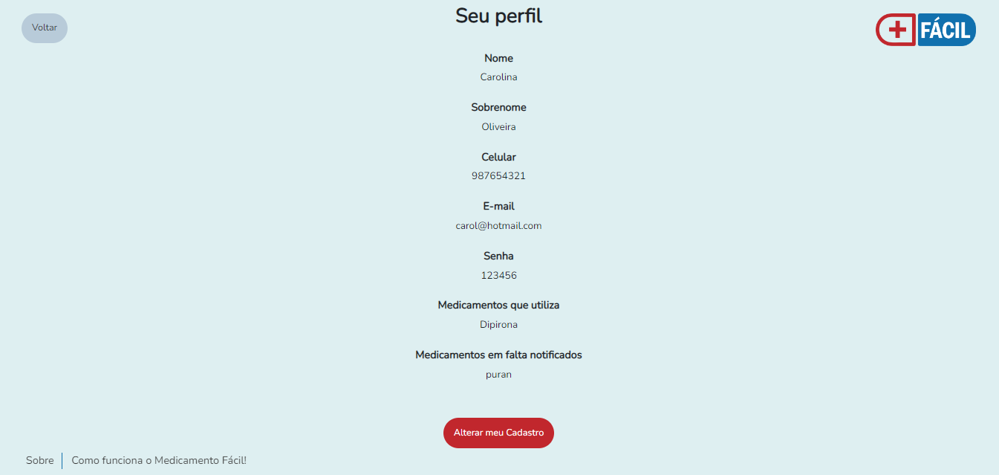
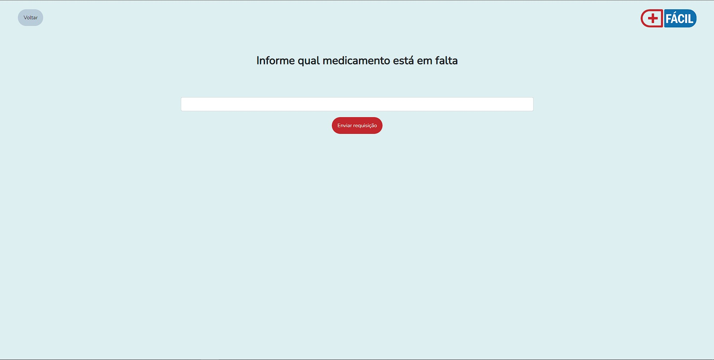
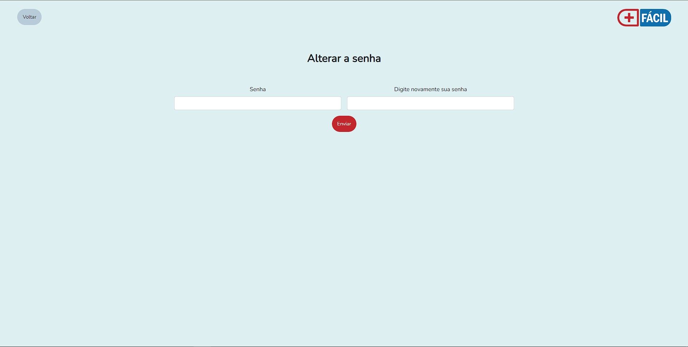
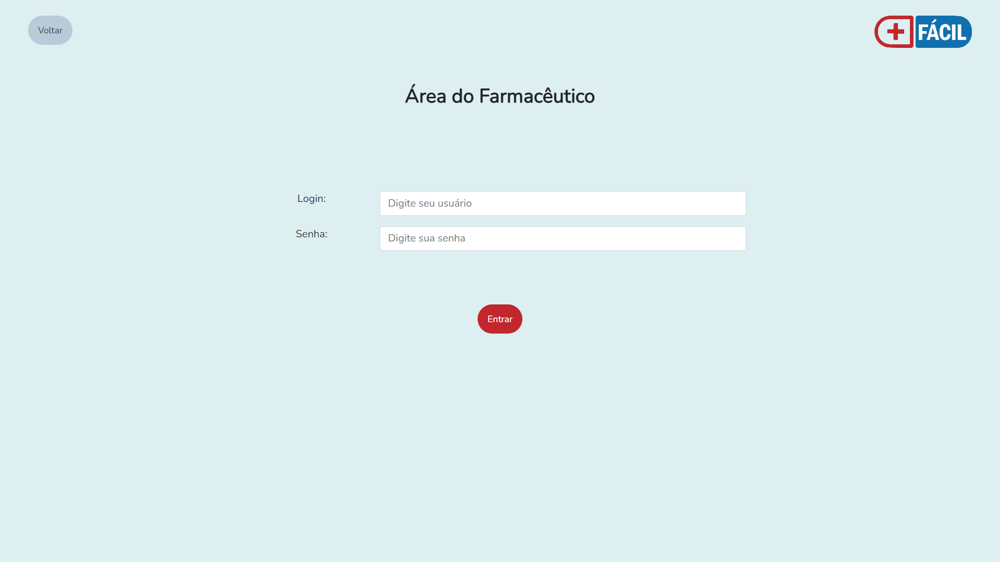
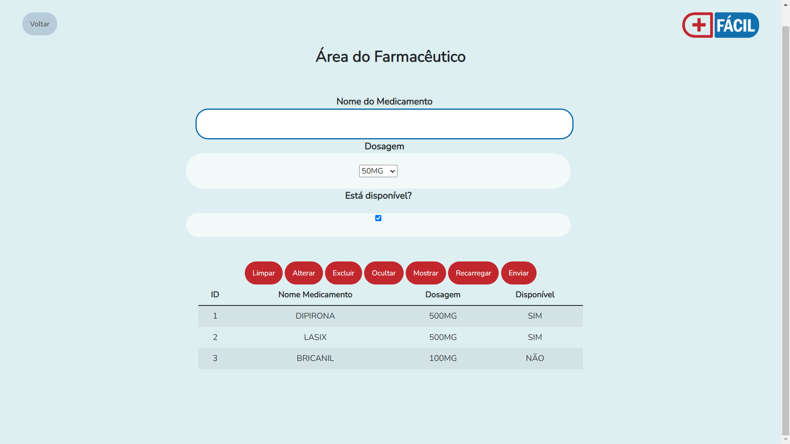

# Programação de Funcionalidades

Nesta seção são apresentadas as telas desenvolvidas para cada uma das funcionalidades do sistema.

Abra um navegador de Internet e informe a seguinte URL: https://icei-puc-minas-pmv-ads.github.io/pmv-ads-2022-1-e1-proj-web-t5-medicamento-facil/src/index


## Tela Inicial (RF-01)
### Desenvolvedor(a): Fagner Vieira Pereira

A Tela Inicial do sistema apresenta apresenta um buscador centralizado, no qual o usuário deverá digitar seu endereço e a fim de direcionar a busca de medicamentos à Unidade Básica de Saúde mais próxima. Esta tela ainda permite que o usuário faça cadastro ou login, bem como acesso à Área do Farmacêutico. Também dispõe dos icones "sobre" e "como funciona o medicamento fácil". Para facilidade de acesso foi incorporado a função de autocompletar o endereço enquanto o usuário digita.


### Requisitos atendidos 

RF-01 -  O site deve apresentar na página principal um buscador no qual o usuário irá digitar seu endereço.

### Artefatos da funcionalidade 

- index.html
- index.js
- template.css
- logo.png

### Estrutura de Dados 

        let endereco_google;
        function initAutocomplete(){
        endereco_google = new google.maps.places.Autocomplete(
            document.getElementById('autocomplete'),
            {
                types: ['address'],
                componentRestrictions: {'country': ['BR']},
                fields: ['address_components']
            })   ;
        }


### Instruções de acesso 

A Tela Inicial é a primeira funcionalidade exibida pelo aplicativo. 

## Tela de confirmação de localização (RF-02)
### Desenvolvedor(a): Fagner Vieira Pereira

A Tela de confirmação de localização apresenta um mapa com um marcador mostrando o local pesquisado na tela anterior, o usuário deverá verificar se o seu endereço está correto e terá duas opções: 1ª - "Confirmar localização", o que irá direcionar o usuário para a página de busca de medicamentos - 2ª - "Tentar novamente", o que irá retornar o usuário à tela anterior. Para facilidade de acesso foi incorporado a função de tratamento de erro, que quando o valor inserido não encontra nenhum endereço válido emite um alerta e retorna o usuário a tela anterior para que ele tente novamente. Esta tela ainda permite que o usuário acesse à Área do Farmacêutico..



### Requisitos atendidos 

RF-02 -  O site deve confirmar a localização do usuário no mapa.

### Artefatos da funcionalidade 

- mapa.html
- mapa.js
- mapa.css
- template.css
- logo.png

### Estrutura de Dados 

	(function () {
	    const itemMapa = document.getElementById("map-canvas");
	    let mapa = null;
	    let marker = null;
	    let geocoder =null;
	    let coordenadas = {lat: -15.8154861, lng: -47.8941659};
	    let urlAtual = window.location.href;
	    let urlClass = new URL(urlAtual);
	    let valor = urlClass.search;   
	    function iniciarMapa() {
		mapa = new google.maps.Map(itemMapa, {
		    center: coordenadas,
		    zoom: 4,});
		    geocoder = new google.maps.Geocoder();
		window.onload = geocodeAddress(geocoder);               
	    }
	    function geocodeAddress(geocoder) {
		let seminterrogacao = valor.replace ("?","");
		geocoder.geocode({'address': seminterrogacao}, function(results, status) 
		{
		  if (status === 'OK') {
		      mapa.setCenter(results[0].geometry.location);
		      mapa.setZoom(16);
		      marker = new google.maps.Marker({
		      map: mapa,
		      position: results[0].geometry.location
		    });
		  } else {
		    alert('Algo deu errado: ' + status + ' Tente Novamente!');
		    window.location.href = "index.html";
		  }
		});
	      }
	    window.initMap = iniciarMapa;})();

### Instruções de acesso 

A Tela confirma localização é exibida após o usuário pesquisar seu endereço na tela inicial. 

## Tela de Busca de Medicamentos (RF-03)
### Desenvolvedor(a): Rider Cantuária.

A Tela de Busca de Medicamentos do sistema apresenta apresenta um buscador centralizado, no qual o usuário deverá digitar os medicamentos de interesse. Esta tela ainda permite que o usuário notifique a falta de um medicamento. Também dispõe dos icones "sobre" e "como funciona o medicamento fácil".


### Requisitos atendidos 

RF-03 -  O site deve apresentar uma página com um buscador no qual o usuário irá digitar os medicamentos buscados.

### Artefatos da funcionalidade 

- buscar-medicamento.html
- template.css
- logo.png

### Artefatos da funcionalidade 

- buscar-medicamento.html
- MedicamentoControlador.js
- logo.png

### Estrutura de Dados 
Acesse a pasta scr/app/entidades e veja Medicamento.js, depois vá em src/app/mocks e acesse medicamento.mock.js e medicamento.mock.min.js

```
export const medicamentos = [{
        "principioAtivo": "ACEBROFILINA",
        "laboratorioNome": "GERMED FARMACEUTICA LTDA",
        "nome": "ACEBROFILINA",
        "apresentacao": "10 MG/ML XPE CT FR PLAS AMB X 120 ML + COP",
        "tarja": "TARJA VERMELHA"
    }, {
        "principioAtivo": "ACEBROFILINA",
        "laboratorioNome": "GERMED FARMACEUTICA LTDA",
        "nome": "ACEBROFILINA",
        "apresentacao": "10 MG/ML XPE CT FR VD AMB X 120 ML + COP",
        "tarja": "TARJA VERMELHA"
    }...
```

### Instruções de acesso 

A Tela de Busca de Medicamentos é a exibida após a confirmação de endereço. 

## Tela de Cadastro (RF-06)
### Desenvolvedor(a): Carolina Felipe Alves de Oliveira

A Tela de Cadastro do sistema apresenta campos nos quais o usuário deverá preencher seus dados para realizar o cadastro. 


### Requisitos atendidos

RF-06 - O site deve ter uma área personalizada, na qual o usuário deverá acessar com login e senha. Nesta área, o usuário irá cadastrar seu e-mail, celular e os medicamentos que utiliza, sendo notificado assim que os medicamentos estiverem disponíveis.

### Artefatos da funcionalidade 

- cadastro.html
- cadastro.js
- template.css
- logo.png

### Estrutura de Dados

Acesse a pasta scr/js e veja cadastro.js.

```
let nome = document.querySelector('#nome')
let labelNome = document.querySelector('#labelNome')
let validNome = false

let sobrenome = document.querySelector('#sobrenome')
let labelSobrenome = document.querySelector('#labelSobrenome')
let validSobrenome = false

let celular = document.querySelector('#celular')
let labelCelular = document.querySelector('#labelCelular')
let validCelular = false

let email = document.querySelector('#email')
let labelEmail = document.querySelector('#labelEmail')
let validEmail = false

let senha = document.querySelector('#senha')
let labelSenha = document.querySelector('#labelSenha')
let validSenha = false

let confirmarSenha = document.querySelector('#confirmarSenha')
let labelConfirmarSenha = document.querySelector('#labelConfirmarSenha')
let validConfirmarSenha = false

let medicamento = document.querySelector('#medicamento')
let labelMedicamento = document.querySelector('#labelMedicamento')
let validMedicamento = false

nome.addEventListener('keyup', ()=>{
    if(nome.value.length < 2){
        labelNome.setAttribute('style', 'color: red')
        labelNome.innerHTML =  'Nome *Insira no mínimo 2 caracteres'
        validNome = false
    } else {
        labelNome.setAttribute('style', 'color: green')
        labelNome.innerHTML = 'Nome'
        validNome = true
    }
})

sobrenome.addEventListener('keyup', ()=>{
    if(sobrenome.value.length < 2){
        labelSobrenome.setAttribute('style', 'color: red')
        labelSobrenome.innerHTML =  'Sobrenome *Insira no mínimo 2 caracteres'
        validSobrenome = false
    } else {
        labelSobrenome.setAttribute('style', 'color: green')
        labelSobrenome.innerHTML = 'Sobrenome'
        validSobrenome = true
    }
})

celular.addEventListener('keyup', ()=>{
    if(celular.value.length <= 8){
        labelCelular.setAttribute('style', 'color: red')
        labelCelular.innerHTML =  'Celular *Insira 9 dígitos'
        validCelular = false
    } else {
        labelCelular.setAttribute('style', 'color: green')
        labelCelular.innerHTML = 'Celular'
        validCelular = true
    }
})

email.addEventListener('keyup', ()=>{
    if(email.value.length <= 8){
        labelEmail.setAttribute('style', 'color: red')
        labelEmail.innerHTML =  'E-mail *Insira um e-mail válido'
        validEmail = false
    } else {
        labelEmail.setAttribute('style', 'color: green')
        labelEmail.innerHTML = 'E-mail'
        validEmail = true
    }
})

senha.addEventListener('keyup', ()=>{
    if(senha.value.length <= 5){
        labelSenha.setAttribute('style', 'color: red')
        labelSenha.innerHTML =  'Senha *Insira no mínimo 6 caracteres'
        validSenha = false
    } else {
        labelSenha.setAttribute('style', 'color: green')
        labelSenha.innerHTML = 'Senha'
        validSenha = true
    }
})

confirmarSenha.addEventListener('keyup', ()=>{
    if(senha.value != confirmarSenha.value){
        labelConfirmarSenha.setAttribute('style', 'color: red')
        labelConfirmarSenha.innerHTML =  'Senha *As senhas devem ser iguais'
        validConfirmarSenha = false
    } else {
        labelConfirmarSenha.setAttribute('style', 'color: green')
        labelConfirmarSenha.innerHTML = 'Confirmar senha'
        validConfirmarSenha = true
    }
})

function cadastrar(){ 
    if (validNome == true  && validSobrenome == true && validCelular == true && validEmail == true  && validSenha == true && validConfirmarSenha == true) { 
      
        let listaUser = JSON.parse(localStorage.getItem('listaUser') || '[]')
        let novoId = 1;
        if (listaUser.length != 0){
        novoId = listaUser[listaUser.length - 1].id + 1;
    } 
         

        listaUser.push(
            {
                id: novoId,
                nomeCad:nome.value,
                sobrenomeCad: sobrenome.value,
                celularCad: celular.value,
                emailCad: email.value,
                senhaCad: senha.value,
                medCad: medicamento.value,
            }
           
          
        )
            
    
        //salvando a lista de usuário no local storage

        localStorage.setItem('listaUser', JSON.stringify(listaUser))
        alert ('Cadastro realizado com sucesso!')
        window.location.href = 'login.html'
       

    } else {
        alert ('Favor preencher os campos!')
    }
}
```

### Instruções de acesso

A Tela de Cadastro é a exibida após o usuário clicar em "Crie sua conta".


## Tela de Login (RF-06)
### Desenvolvedor(a): Carolina Felipe Alves de Oliveira

A Tela de Login do sistema apresenta campos nos quais o usuário deverá digitar e-mail e senha cadastrados para acessar a área do usuário. Esta tela também apresenta o botão “esqueceu sua senha?” para o caso em que o usuário necessite recuperar o acesso.


### Requisitos atendidos

RF-06 - O site deve ter uma área personalizada, na qual o usuário deverá acessar com login e senha. Nesta área, o usuário irá cadastrar seu e-mail, celular e os medicamentos que utiliza, sendo notificado assim que os medicamentos estiverem disponíveis.

### Artefatos da funcionalidade 

- login.html
- login.js
- template.css
- logo.png

### Estrutura de Dados

```
   function logar ()
{  
    let usuario = document.querySelector('#login');
    let senha = document.querySelector('#senha');

    let listaUser = [];

    let userValid = {
        nome: '',
        sobrenome: '',
        celular: '',
        email: '',
        senha: '',
        medicamento:''

    }


    listaUser = JSON.parse(localStorage.getItem('listaUser'))


    listaUser.forEach((item) =>{

         if(usuario.value === item.emailCad && senha.value === item.senhaCad){
            userValid = {
                nome: item.nomeCad,
                sobrenome: item.sobrenomeCad,
                celular: item.celularCad,
                email: item.emailCad,
                senha: item.senhaCad,
                medicamento: item.medCad
            }
        }

    })

    if (!usuario.value && !senha.value) {
        alert('Preencha todos os campos');
        location.reload(true);
  
    }
    else if(usuario.value === userValid.email && senha.value === userValid.senha){
        localStorage.setItem('userLogado', JSON.stringify(userValid)) 
       // document.location.href = 'area-usuario.html'; 
        window.open ('area-usuario.html')
        
        
    } 
    
     if  (usuario.value != userValid.email || senha.value != userValid.senha){
        alert ('Usuário ou senha incorretos');
        location.reload(true);
    }

   
}

```

### Instruções de acesso

A Tela de Login é a exibida após o usuário clicar em "Faça Login".

## Tela Área do Usuário (RF-06)
### Desenvolvedor(a): Carolina Felipe Alves de Oliveira

A Tela de Área do usuário apresenta o nome do usuário logado e os botões "vizualizar meu perfil", "pesquisar medicamento" e "notificar a falta de medicamento". 




### Requisitos atendidos

RF-06 - O site deve ter uma área personalizada, na qual o usuário deverá acessar com login e senha. Nesta área, o usuário irá cadastrar seu e-mail, celular e os medicamentos que utiliza, sendo notificado assim que os medicamentos estiverem disponíveis.

### Artefatos da funcionalidade 

- area-usuario.html
- area-usuario.js
- template.css
- logo.png

### Estrutura de Dados

    let userLogado = JSON.parse(localStorage.getItem("userLogado"));
    let logado = document.querySelector("#logado");

    logado.innerHTML = `Olá, ${userLogado.nome}, o que você deseja?`


### Instruções de acesso

A Tela de Área do Usuário é a exibida após o usuário fazer login.

## Tela Visualizar Perfil (RF-14)
### Desenvolvedor(a): Carolina Felipe Alves de Oliveira

A Tela de Visualizar Perfil apresenta os dados do usuário cadastrado. 




### Requisitos atendidos

RF-14 - O site deve permitir que o usuário visualize e altere seus dados cadastrados.

### Artefatos da funcionalidade 

- usuario-cadastrado.html
- usuario-cadastrado.js
- template.css
- logo.png

### Estrutura de Dados

    
    let userLogado = JSON.parse(localStorage.getItem("userLogado"));
    let cadastradoNome = document.querySelector("#cadastradoNome");
    let cadastradoSobrenome = document.querySelector("#cadastradoSobrenome");
    let cadastradoCelular = document.querySelector("#cadastradoCelular");
    let cadastradoEmail = document.querySelector("#cadastradoEmail");
    let cadastradoSenha = document.querySelector("#cadastradoSenha");
    let cadastradoMed = document.querySelector("#cadastradoMed");
    let notificado = JSON.parse(localStorage.getItem("notificado"));
    let cadastradoNotificacao = document.querySelector("#cadastradoNotificacao");

    cadastradoNome.innerHTML =  userLogado.nome;
    cadastradoSobrenome.innerHTML =  userLogado.sobrenome;
    cadastradoCelular.innerHTML =  userLogado.celular;
    cadastradoEmail.innerHTML =  userLogado.email;
    cadastradoSenha.innerHTML =  userLogado.senha;
    cadastradoMed.innerHTML =  userLogado.medicamento;
    cadastradoNotificacao.innerHTML = notificado.nome;


### Instruções de acesso

A Tela de Visualizar Perfil é a exibida após o usuário fazer login e acessar a área do usuário.


## Tela Notificar falta de medicamento (RF-09)
### Desenvolvedor: Rafael Penido de Souza

A Tela Notificar falta medicamento apresenta uma caixa de texto centralizada onde o usuário poderá preencher o nome do medicamento que está em falta e em seguida enviar clicando no botão "Enviar requisição" logo abaixo. 



### Requisitos atendidos 

RF-09 -  O site deve permitir que o próprio usuário notifique a falta de um determinado medicamento.

### Artefatos da funcionalidade 

- notificar-medicamento.html
- notificar.js
- template.css
- logo.png

### Estrutura de Dados 

```
function notificar (){
    let nomeMedicamento = document.getElementById("nomeMedicamento");

    let dados = JSON.parse(localStorage.getItem("dadosMedicamento"));

    if(dados == null){
         localStorage.setItem("dadosMedicamento", "[]");
         dados = [];
    }

    let notificado = [];
    notificado = JSON.parse(localStorage.getItem('notificado'))

    let auxRegistro = {
        nome: nomeMedicamento.value
    
    }

    dados.push(auxRegistro);

    localStorage.setItem("dadosMedicamento", JSON.stringify(dados));
    localStorage.setItem('notificado', JSON.stringify(auxRegistro));
    alert("Requisição de medicamento enviada!")

    nomeMedicamento.value = "";
}
```
### Instruções de acesso

A Tela Notificar falta de medicamento é exibida após o usuário clicar em "Notificar falta de medicamento" nas telas "Buscar medicamento" e "Área do usuário".

## Tela Esqueceu sua senha (RF-10)
### Desenvolvedor(a): Tauan Gonçalves Silva

A Tela Esqueceu sua senha permite que o usuário preencha seu e-mail para fazer a recuperação de senha. A tela ainda conta com o itens "Sobre" e "Como funciona?", nos quais o usuário, ao passar o mouse acessa os balões com as informações correspondentes.


### Requisitos atendidos 

RF-10 -  O site deve permitir que o usuário recupere sua senha em caso de esquecimento.

### Artefatos da funcionalidade 

- esqueceu-senha.html
- template.css
- logo.png


### Instruções de acesso

A Tela da esquecimento de senha é exibida após o usuário clicar em "esqueceu sua senha?" na tela de login.

## Tela Alterar senha (RF-10)
### Desenvolvedor: Rafael Penido de Souza

A Tela Alterar senha apresenta dois campos:  "Senha" - onde o usuário preencherá com a nova senha e "Digite novamente sua senha" - onde deverá confirmar a senha escolhida e confirmar clicando no botão "Enviar" logo abaixo.



### Requisitos atendidos 

RF-10 -  O site deve permitir que o usuário recupere sua senha em caso de esquecimento.

### Artefatos da funcionalidade 

- alterar-senha.html
- template.css
- alterarSenha.js
- logo.png

### Estrutura de Dados 

```
senha.addEventListener('keyup', ()=>{
    if(senha.value.length <= 5){
        labelSenha.setAttribute('style', 'color: red')
        labelSenha.innerHTML =  '*Insira no mínimo 6 caracteres*'
        validSenha = false
    } else {
        labelSenha.setAttribute('style', 'color: green')
        labelSenha.innerHTML = 'Nova senha'
        validSenha = true
    }
})

confirmarSenha.addEventListener('keyup', ()=>{
    if(senha.value != confirmarSenha.value){
        labelConfirmarSenha.setAttribute('style', 'color: red')
        labelConfirmarSenha.innerHTML =  '*As senhas devem ser iguais*'
        validConfirmarSenha = false
    } else {
        labelConfirmarSenha.setAttribute('style', 'color: green')
        labelConfirmarSenha.innerHTML = 'Confirmar senha'
        validConfirmarSenha = true
    }
})
```
### Instruções de acesso

A Tela da alterar a senha é exibida após o usuário receber o código de recuperação.

## Tela Novo Cadastro (RF-13)
### Desenvolvedor(a): Carolina Felipe Alves de Oliveira

A Tela de novo cadastro apresenta os campos para preenchimento de todo o cadastro do usuário.


### Requisitos atendidos 

RF-15 -  O site deve permitir que o usuário visualize e altere seus dados cadastrados.

### Artefatos da funcionalidade 

- novo-cadastro.html
- template.css
- novo-cadastro.js
- logo.png

### Estrutura de Dados 

```
var nome = document.querySelector('#nome')
var labelNome = document.querySelector('#labelNome')
var validNome = false

var sobrenome = document.querySelector('#sobrenome')
var labelSobrenome = document.querySelector('#labelSobrenome')
var validSobrenome = false

var celular = document.querySelector('#celular')
var labelCelular = document.querySelector('#labelCelular')
var validCelular = false

var email = document.querySelector('#email')
var labelEmail = document.querySelector('#labelEmail')
var validEmail = false

var senha = document.querySelector('#senha')
var labelSenha = document.querySelector('#labelSenha')
var validSenha = false

var confirmarSenha = document.querySelector('#confirmarSenha')
var labelConfirmarSenha = document.querySelector('#labelConfirmarSenha')
var validConfirmarSenha = false

var medicamento = document.querySelector('#medicamento')
var labelMedicamento = document.querySelector('#labelMedicamento')
var validMedicamento = false


nome.addEventListener('keyup', ()=>{
    if(nome.value.length < 2){
        labelNome.setAttribute('style', 'color: red')
        labelNome.innerHTML =  'Nome *Insira no mínimo 2 caracteres'
        validNome = false
    } else {
        labelNome.setAttribute('style', 'color: green')
        labelNome.innerHTML = 'Nome'
        validNome = true
    }
})

sobrenome.addEventListener('keyup', ()=>{
    if(sobrenome.value.length < 2){
        labelSobrenome.setAttribute('style', 'color: red')
        labelSobrenome.innerHTML =  'Sobrenome *Insira no mínimo 2 caracteres'
        validSobrenome = false
    } else {
        labelSobrenome.setAttribute('style', 'color: green')
        labelSobrenome.innerHTML = 'Sobrenome'
        validSobrenome = true
    }
})

celular.addEventListener('keyup', ()=>{
    if(celular.value.length <= 8){
        labelCelular.setAttribute('style', 'color: red')
        labelCelular.innerHTML =  'Celular *Insira 9 dígitos'
        validCelular = false
    } else {
        labelCelular.setAttribute('style', 'color: green')
        labelCelular.innerHTML = 'Celular'
        validCelular = true
    }
})

email.addEventListener('keyup', ()=>{
    if(email.value.length <= 8){
        labelEmail.setAttribute('style', 'color: red')
        labelEmail.innerHTML =  'E-mail *Insira um e-mail válido'
        validEmail = false
    } else {
        labelEmail.setAttribute('style', 'color: green')
        labelEmail.innerHTML = 'E-mail'
        validEmail = true
    }
})

senha.addEventListener('keyup', ()=>{
    if(senha.value.length <= 5){
        labelSenha.setAttribute('style', 'color: red')
        labelSenha.innerHTML =  'Senha *Insira no mínimo 6 caracteres'
        validSenha = false
    } else {
        labelSenha.setAttribute('style', 'color: green')
        labelSenha.innerHTML = 'Senha'
        validSenha = true
    }
})

confirmarSenha.addEventListener('keyup', ()=>{
    if(senha.value != confirmarSenha.value){
        labelConfirmarSenha.setAttribute('style', 'color: red')
        labelConfirmarSenha.innerHTML =  'Senha *As senhas devem ser iguais'
        validConfirmarSenha = false
    } else {
        labelConfirmarSenha.setAttribute('style', 'color: green')
        labelConfirmarSenha.innerHTML = 'Confirmar senha'
        validConfirmarSenha = true
    }
})


function cadastrarNovo() {


   if (validNome == true  && validSobrenome == true && validCelular == true && validEmail == true  && validSenha == true && validConfirmarSenha == true) { 
    
    let userLogado = JSON.parse(localStorage.getItem("userLogado"));
    let listaUser = JSON.parse(localStorage.getItem("listaUser"));
    let cad = userLogado.nome;
    let index;


     for  (var i = 0; i < listaUser.length; i++){
        if (cad === listaUser[i].nomeCad){
        index = listaUser[i].id; 
        listaUser[i].nomeCad = nome.value,
        listaUser[i].sobrenomeCad = sobrenome.value,
        listaUser[i].celularCad = celular.value,
        listaUser[i].emailCad = email.value,
        listaUser[i].senhaCad = senha.value,
        listaUser[i].medCad = medicamento.value
        
        listaUser.push;
        }
     } 

    // Atualiza os dados no Local Storage
    localStorage.setItem('userLogado', JSON.stringify(userLogado));
    localStorage.setItem('listaUser', JSON.stringify(listaUser));
    alert ('Alteração de cadastro realizada com sucesso!')
        window.location.href = 'login.html'

    } else {
        alert ('Favor preencher os campos!')
    }
}


```
### Instruções de acesso

A Tela de Novo Cadastro é a exibida após o usuário acessar a área do usuário e clicar em "alterar cadastro".


## Tela Login do Farmacêutico (RF-05)

### Desenvolvedor(a): Fabiana Alkmim Avelar

A Tela de Login do Farmacêutico apresenta os campos de login e senha, nos quais o farmacêutico deverá inserir seus dados. Esta tela ainda permite retornar à tela inicial. Também dispõe dos icones "sobre" e "como funciona o medicamento fácil".



### Requisitos atendidos 

RF-05 -  O site deve ter uma área de login do farmacêutico, na qual ele irá atualizar o estoque de medicamentos disponíveis pela farmácia da UBS.

### Artefatos da funcionalidade 

- login-farmaceutico.html
- template.css
- logo.png

### Estrutura de Dados 

        function logar()
            {
                var login = document.getElementById('login').value;
                var senha = document.getElementById('senha').value;
                var validado=false;
                if (login == "farmaceuticobh@ubs.com" && senha == "1234"){
                    location.href = "area-farmaceutico.html?login="+login+"&nome=Lucas";
                    validado=true;
                }
                if (login == "farmaceuticorj@ubs.com" && senha == "1234"){
                    location.href = "area-farmaceutico.html?login="+login+"&nome=Tadeu";
                    validado=true;
                }
                if (login == "farmaceuticosp@ubs.com" && senha == "1234"){
                    location.href = "area-farmaceutico.html?login="+login+"&nome=Paulo";
                    validado=true;
                }
                if(validado==false) {
                    alert ('Usuário ou senha incorretos! \nTente novamente.');
                }
            }


### Instruções de acesso 

A Tela de Login do Farmacêutico é direcionada ao clicar no botão "Área do Farmacêutico" na home page. 


## Tela Área do Farmacêutico

### Desenvolvedor(a): Fabiana Alkmim Avelar

A Tela área do farmacêutico possui os campos nome do medicamento, dosagem e a disponibilidade do medicamento, o cadastro dessas informações será realizado pelo farmacêutico, ele poderá cadastrar, excluir, alterar, mostrar e ocultar as informações dos medicamentos cadastrados. Também dispõe dos ícones "sobre" e "como funciona o medicamento fácil".



### Requisitos atendidos

RF-05 - O site deve ter uma área de login do farmacêutico, na qual ele irá atualizar o estoque de medicamentos disponíveis pela farmácia da UBS.
Artefatos da funcionalidade

### Artefatos da funcionalidade

- areafarmaceutico.html
- template.css
- logo.png
- medicamentos.js

### Estrutura de Dados

        function init() {
            exibeMedicamentos();

            // Adiciona funções para tratar os eventos 
            $("#btnInsert").click(function () {
                // Verfica se o formulário está preenchido corretamente
                if (!$('#form-medicamento')[0].checkValidity()) {
			
                    displayMessage("Preencha o formulário corretamente.");
                    return;
                }

                // Obtem os valores dos campos do formulário
                let campoNomeMedicamento = $("#inputNomeMedicamento").val();
                let campoDosagem = $("#inputDosagem").val();
                let campoDisponibilidade = $("#inputDisponibilidade").val();
                
                let medicamento= { nomeMedicamento: campoNomeMedicamento, 
                    dosagem: campoDosagem, 
                    disponibilidade: campoDisponibilidade };
				
                insertMedicamento(medicamento);
                alert("Medicamento armazenado com sucesso!");

                // Reexibe os medicamentos
                exibeMedicamentos();

                // Limpa o formulario
                $("#form-medicamento")[0].reset();
            });


            $("#btnView").click(function () {
                document.location.reload(true);
            });

            $("#btnOcultar").click(function () {
            $("#table-medicamentos").html("").hide();
        });
              


        $("#btnMostrar").click(function () {
            $("#table-medicamentos").html("").show();
            exibeMedicamentos();
        });


            // Oculta a mensagem de aviso após alguns segundos
            $('#msg').bind("DOMSubtreeModified", function () {
                window.setTimeout(function () {
                    $(".alert").fadeTo(500, 0).slideUp(500, function () {
                        $(this).remove();
                    });
                }, 5000);
            });

        

          // Intercepta o click do botão Alterar
          $("#btnUpdate").click(function () {
              
                // Obtem os valores dos campos do formulário
                let campoId = $("#inputId").val();
				
                if (campoId == "") {
                    alert("Selecione um medicamento para ser alterado.");
                    return;
                }
                // Obtem os valores dos campos do formulário
                let campoNomeMedicamento = $("#inputNomeMedicamento").val();
                let campoDosagem = $("#inputDosagem").val();

                /*
                if(campoDosagem.val=="50MG"){
                    var dosradio = document.getElementsByName('dosagem1');
              
                    dosradio.checked;
                }
                if(campoDosagem.val=="100MG"){
                    var dosradio = document.getElementsByName('dosagem2');
                    dosradio.checked;
                }
                if(campoDosagem.val=="250MG"){
                    var dosradio = document.getElementsByName('dosagem3');
                    dosradio.checked;
                }
                if(campoDosagem.val=="500MG"){
                    var dosradio = document.getElementsByName('dosagem4');
                    dosradio.checked;
                }
                */
                let campoDisponibilidade = $("#inputDisponibilidade").val();

                var checkbox = document.getElementById('inputDisponibilidade');
                if (checkbox.checked==true)
                    campoDisponibilidade="SIM";
                else
                    campoDisponibilidade="NÃO";
                
                let medicamento= { nomeMedicamento: campoNomeMedicamento, 
                    dosagem: campoDosagem, 
                    disponibilidade: campoDisponibilidade };

                updateMedicamento(parseInt(campoId), medicamento);

                // Reexibe os medicamentos
                exibeMedicamentos();

                // Limpa o formulario
                $("#form-medicamento")[0].reset();
            });

             // Intercepta o click do botão Listar Medicamentos
             $("#btnClear").click(function () {
                $("#form-medicamento")[0].reset();
            });
        
 // Intercepta o click do botão Excluir
 $("#btnDelete").click(function () {
                let campoId = $("#inputId").val();
                if (campoId == "") {
                    alert("Selecione um medicamento a ser excluído.");
                    return;
                }
                deleteMedicamento(parseInt(campoId));

                // Reexibe os contatos
                exibeMedicamentos();

                // Limpa o formulario
                $("#form-medicamento")[0].reset();
            });


 // Preenche o formulário quando o usuario clicar em uma linha da tabela 
 $("#grid-medicamentos").on("click", "tr", function (e) {
                let linhaMedicamento = this;
                colunas = linhaContato.querySelectorAll("td");

                $("#inputId").val(colunas[0].innerText);
                $("#inputNomeMedicamento").val(colunas[1].innerText);
                $("#inputDosagem").val(colunas[2].innerText);
                $("#inputDisponibilidade").val(colunas[3].innerText);

                if(colunas[2].innerText=="100")
                var dosradio = document.getElementsById('inputDosagem');
                //$("#inputDosagem").

                var checkbox = document.getElementById('inputDisponibilidade');
                if(colunas[3].innerText=="SIM")
                    checkbox.checked = true;
                else
                    checkbox.checked = false; 
            
            });
}

        function exibeMedicamentos() {
            // Remove todas as linhas do corpo da tabela
            $("#table-medicamentos").html("");

            // Popula a tabela com os registros do banco de dados
            for (i = 0; i < db.data.length; i++) {
                let medicamentos = db.data[i];    
                $("#table-medicamentos").append(`<tr>
                                                <td>${medicamentos.id}</td>
                                                <td>${medicamentos.nomeMedicamento.toUpperCase()}</td>
                                                <td>${medicamentos.dosagem.toUpperCase()}</td>
                                                <td>${medicamentos.disponibilidade.toUpperCase()}</td>
                                            </tr>`);
                    
            }
        }

### Instruções de acesso

A Tela de Área do Farmacêutico é exibida após o farmacêutico efetuar o login na pagina "login do farmacêutico", que é exibida ao clicar na "Área do Farmacêutico" na home page.
